# 模拟与实现

## NOIP2016 普及组

### T1 铅笔 (Pencil)

小明有 n 支铅笔需要准备。铅笔以盒为单位出售，每盒有 k 支，价格为 p 元。小明最少需要花多少钱？

#### 输入格式

一行三个整数 n, k, p，分别表示需要的铅笔数量、每盒的铅笔数量、每盒的价格。

#### 输出格式

一行一个整数，表示最少需要花的钱数。

#### 样例输入

```
57 2 2
```

#### 样例输出

```
54
```

#### 样例输入2

```
50 30 30
```

#### 样例输出2

```
60
```

#### 数据范围与约定

| 测试点编号 | n | k | p |
|-----------|---|---|---|
| 1~3 | n≤100 | k=1 | p=1 |
| 4~6 | n≤10000 | k=1 | p=1 |
| 7~8 | n≤10000 | k=10 | p=1 |
| 9~10 | n≤10000 | k=100 | p=100 |

其中 n, k, p 均为正整数，且 n ≤ 10000。

---

### T2 回文日期 (Date)

在日常生活中，通过年、月、日这三个要素可以表示出一个唯一确定的日期。

小明在书上看到一个8位数字表示的日期格式：`YYYYMMDD`（即年份、月份、日期各用两位表示，不足两位时前补0）。他很好奇这个8位数字是否满足以下条件：

1. 该日期是一个合法的日期。
2. 该8位数字从左向右读和从右向左读是相同的（即回文数）。

给定一个8位数字 d，请判断它是哪种情况：

- 如果 d 不是一个合法的日期，输出 1。
- 如果 d 是一个合法的日期且是回文日期，输出 2。
- 如果 d 是一个合法的日期但不是回文日期，输出 3。

#### 输入格式

一行一个8位整数 d。

#### 输出格式

一行一个整数，表示判断结果。

#### 样例输入1

```
20110101
```

#### 样例输出1

```
3
```

#### 样例输入2

```
20000101
```

#### 样例输出2

```
2
```

#### 数据范围与约定

年份在 1000~9999 之间。

---

## NOIP2017 普及组

### T1 成绩 (Score)

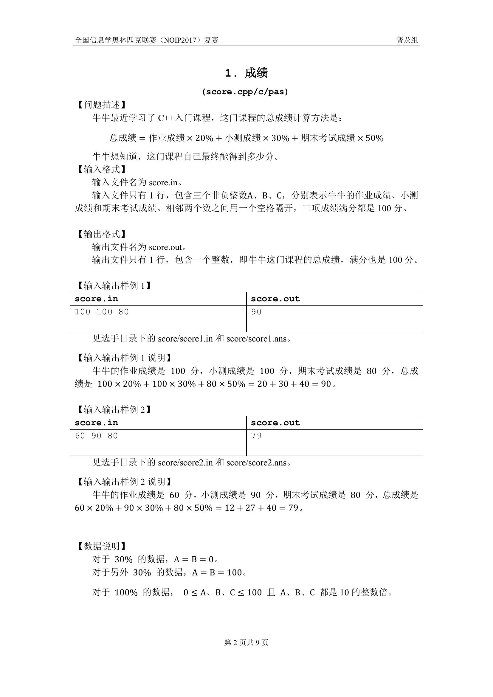

小明同学参加了某次考试，已知他的三项成绩：平时作业成绩 A、小测成绩 B、期末考试成绩 C。

总成绩的计算公式为：总成绩 = A × 20% + B × 30% + C × 50%。

其中 A、B、C 均为 0~100 之间的整数，且均为 10 的倍数。

#### 输入格式

一行三个整数 A, B, C，分别表示平时作业成绩、小测成绩、期末考试成绩。

#### 输出格式

一行一个整数，表示总成绩（四舍五入到整数）。

#### 样例输入1

```
100 100 80
```

#### 样例输出1

```
90
```

#### 样例输入2

```
60 90 80
```

#### 样例输出2

```
79
```

#### 数据范围与约定

- 0 ≤ A, B, C ≤ 100
- A, B, C 均为 10 的倍数

---

### T2 图书管理员 (Librarian)

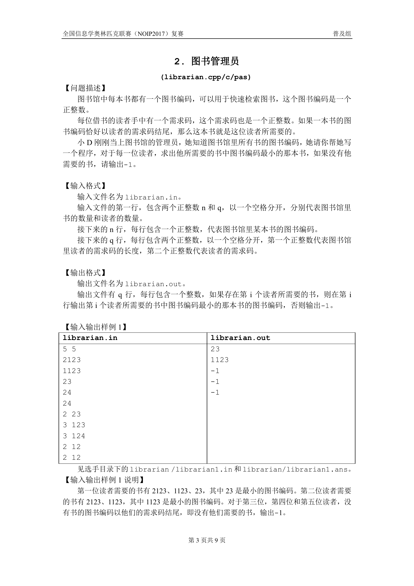

图书馆中每本书都有一个唯一的编码。一位读者来到图书馆，告诉图书管理员他想要借的书的编码特征：该书的编码的最后若干位与他给出的数字相同。

图书管理员需要在所有书中找到满足条件的最小编码。如果找不到满足条件的书，输出 -1。

#### 输入格式

第一行两个整数 n 和 q，分别表示书的数量和查询次数。

接下来 n 行，每行一个整数，表示一本书的编码。

接下来 q 行，每行一个整数，表示一次查询的需求码。

#### 输出格式

对于每次查询，输出一行一个整数，表示满足条件的最小编码。如果找不到，输出 -1。

#### 样例输入

```
5 3
123456789
987654321
123454321
987654320
123456780
123
1
321
```

#### 样例输出

```
123454321
-1
987654321
```

#### 数据范围与约定

- 1 ≤ n, q ≤ 1000
- 书的编码和需求码均为不超过 10 位的正整数

---

## NOIP2018 普及组

### T1 标题统计 (Title)

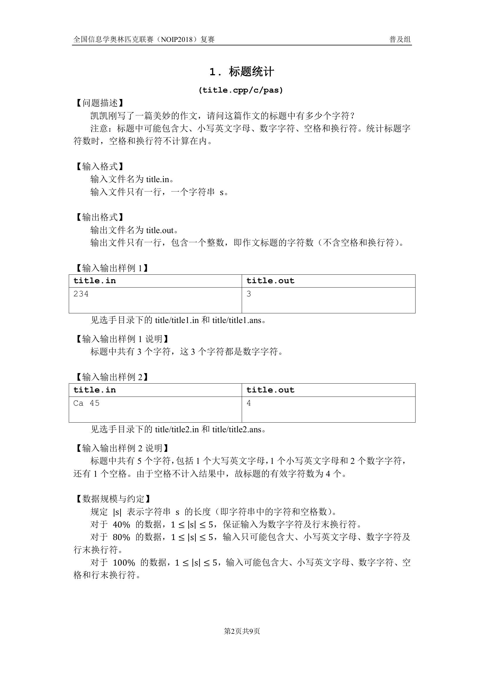

学校正在举办科技创新大赛，要求参赛队伍提交作品标题。评审委员会需要统计每个标题的字符数（不包括空格和换行符）。

给定一个字符串 s，统计其中非空格、非换行字符的个数。

#### 输入格式

一行一个字符串 s，可能包含空格和换行符。字符串长度不超过 1000 个字符。

#### 输出格式

一行一个整数，表示字符串中非空格、非换行字符的个数。

#### 样例输入1

```
234
```

#### 样例输出1

```
3
```

#### 样例输入2

```
Ca 45
```

#### 样例输出2

```
4
```

#### 数据范围与约定

字符串长度 |s| ≤ 1000。

---

### T2 龙虎斗 (Fight)

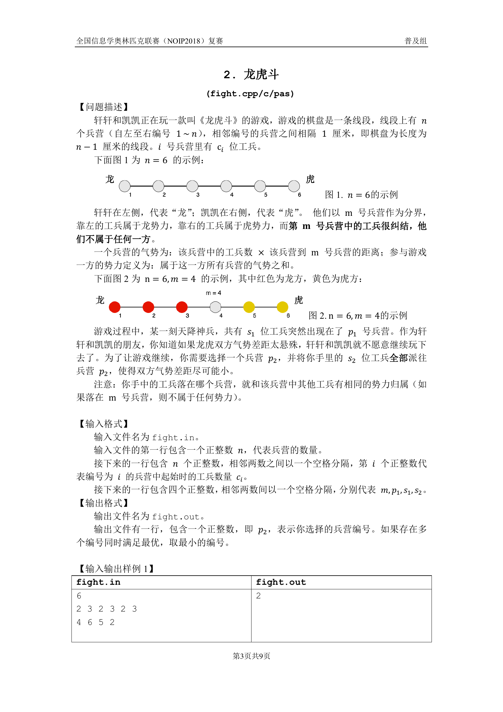

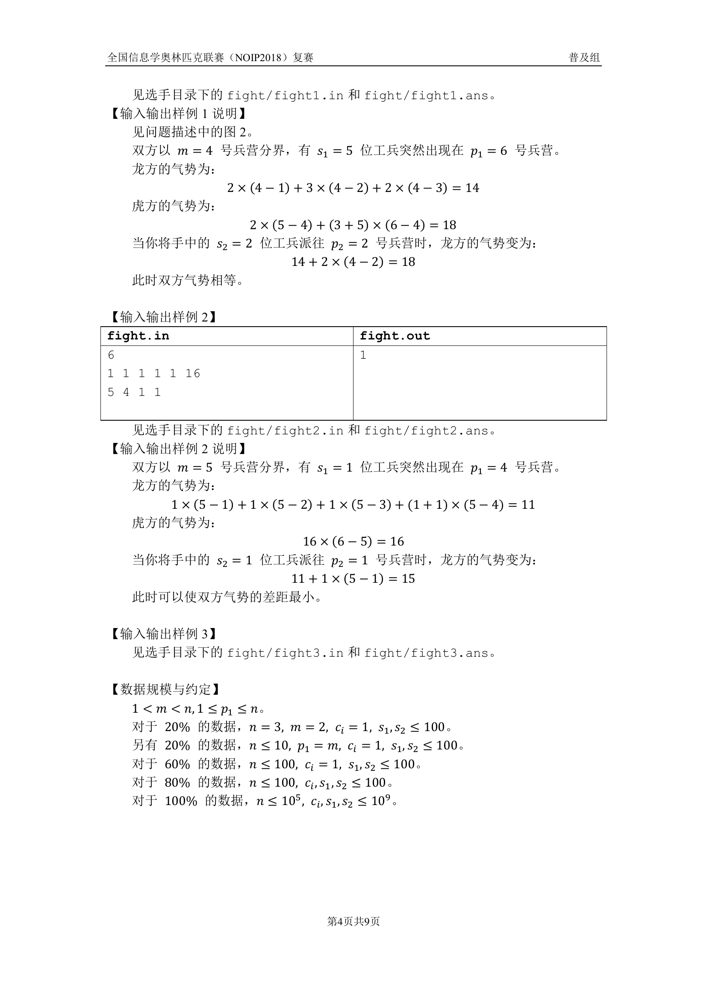

一共有 n 个兵营，编号从 1 到 n，排成一排。其中第 m 个兵营是分界点，编号 1~m 的兵营属于龙军，编号 m+1~n 的兵营属于虎军。

每个兵营 i 有 c_i 个士兵。龙军的气势定义为：所有龙军兵营的（士兵数 × 兵营编号）之和。虎军的气势定义为：所有虎军兵营的（士兵数 × 兵营编号）之和。

现在龙军已经在 p1 号兵营增加了 s1 个工兵。为了让两军气势差的绝对值最小，需要在虎军的某个兵营 p2 增加 s2 个工兵。

求在哪个兵营 p2 增加工兵可以使两军气势差的绝对值最小。

#### 输入格式

第一行一个整数 n。

第二行 n 个整数 c_1, c_2, ..., c_n，表示每个兵营的士兵数。

第三行四个整数 m, p1, s1, s2，分别表示分界点、龙军工兵出现的位置、龙军工兵数量、虎军工兵数量。

#### 输出格式

一行一个整数 p2，表示虎军应该在哪个兵营增加工兵。如果有多个答案，输出编号最小的。

#### 样例输入

```
8
1 2 3 4 5 6 7 8
4 4 1 1
```

#### 样例输出

```
7
```

#### 数据范围与约定

- 1 ≤ n ≤ 10^5
- 1 ≤ m ≤ n
- 1 ≤ c_i ≤ 1000
- 1 ≤ p1 ≤ m
- 1 ≤ s1, s2 ≤ 1000

---

## CSP-J 2019

### T1 数字游戏 (Game)

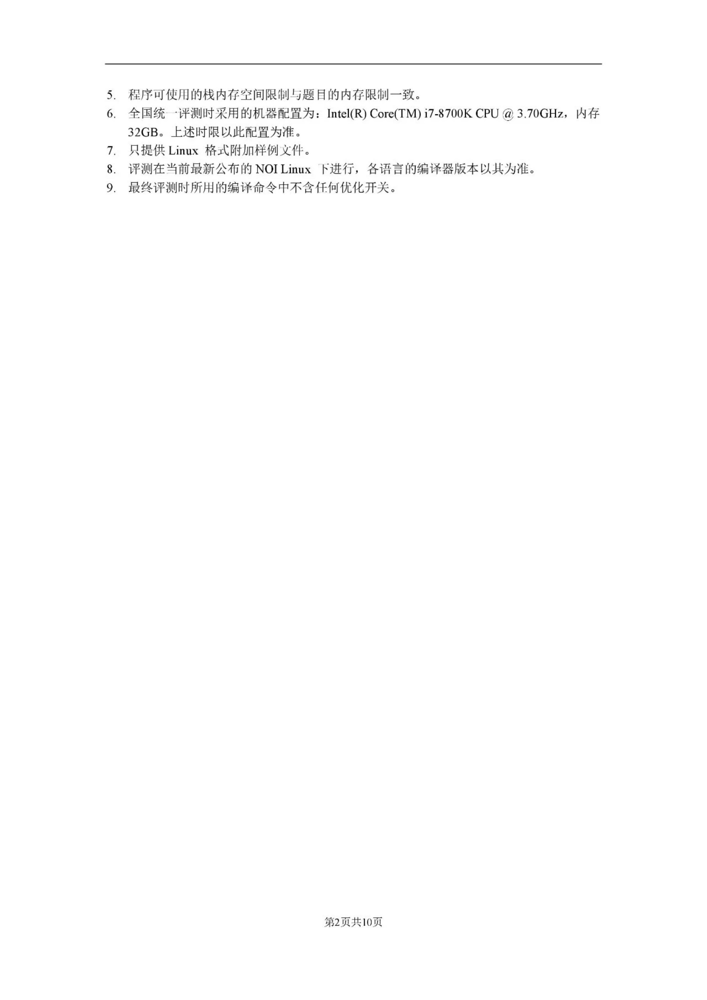

小明发明了一个小游戏。他在纸上写了一个由 8 个字符组成的字符串，每个字符是 '0' 或 '1'。然后他让小红来猜这个字符串中有多少个 '1'。

给定一个由 8 个字符组成的字符串，其中每个字符是 '0' 或 '1'，请统计其中 '1' 的个数。

#### 输入格式

一行一个由 8 个字符组成的字符串，每个字符是 '0' 或 '1'。

#### 输出格式

一行一个整数，表示字符串中 '1' 的个数。

#### 样例输入

```
10101101
```

#### 样例输出

```
5
```

#### 数据范围与约定

字符串长度固定为 8，每个字符为 '0' 或 '1'。

---

### T2 公交换乘 (Transfer)

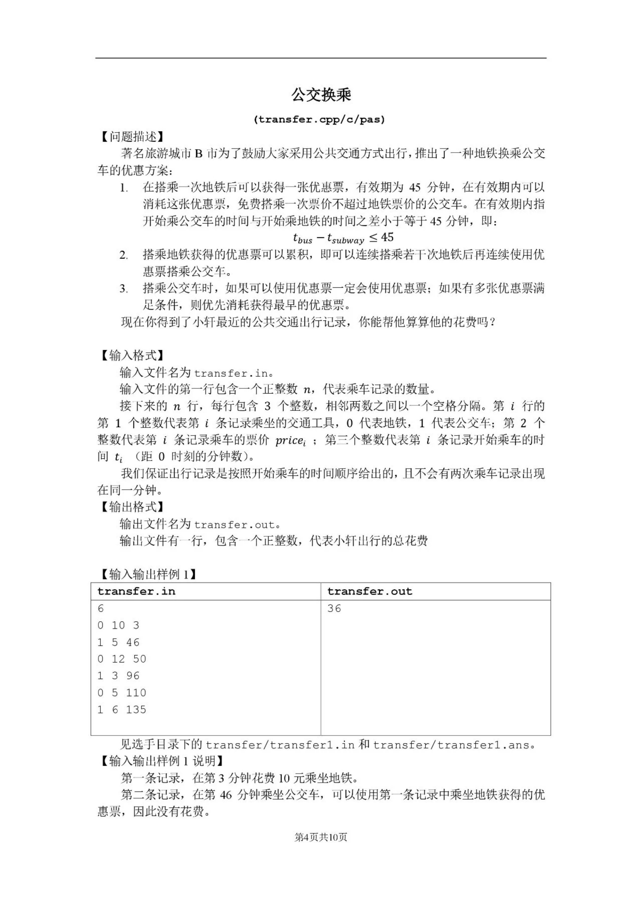

小明每天乘坐公共交通上下班。他有以下优惠规则：

- 如果乘坐地铁（类型 0），可以获得一张优惠券，该优惠券在 45 分钟内可以免费乘坐一次价格不超过该次地铁票价的公交（类型 1）。
- 如果乘坐公交（类型 1），且在 45 分钟内有未使用的优惠券（该次公交票价不超过优惠券对应地铁票价），则免费；否则需支付公交票价。

给定 n 条乘车记录，求小明的总花费。

#### 输入格式

第一行一个整数 n，表示乘车记录数。

接下来 n 行，每行三个整数 type, price, time，分别表示交通类型（0=地铁，1=公交）、票价、乘车时间（以分钟为单位的时刻）。

#### 输出格式

一行一个整数，表示总花费。

#### 样例输入

```
6
0 5 0
1 4 10
1 6 20
0 7 30
1 5 40
1 8 50
```

#### 样例输出

```
16
```

#### 数据范围与约定

- 1 ≤ n ≤ 10^5
- 1 ≤ price ≤ 1000
- 0 ≤ time ≤ 10^9

---

## CSP-J 2020

### T2 直播获奖 (Award)

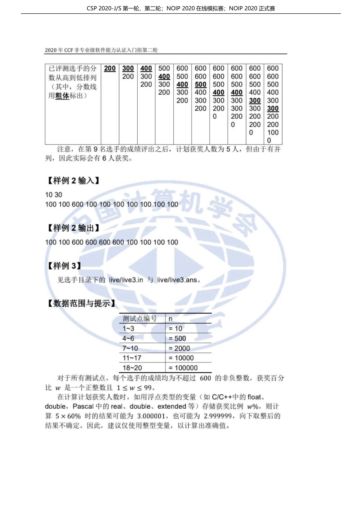

小明在看一场编程比赛的直播。比赛共有 n 名选手参加。裁判实时公布获奖分数线。

获奖规则如下：每一时刻，假设当前已有 m 名选手提交了成绩，则获奖人数为 max(1, ⌊m × w%⌋)，其中 w 是一个给定的百分比。获奖分数线为：将已提交成绩的选手按分数从高到低排序，第 ⌊m × w%⌋ 名选手的分数即为分数线（如果 ⌊m × w%⌋ = 0，则分数线为 0）。

给定 n 名选手按提交顺序的成绩，求每一时刻的获奖分数线。

#### 输入格式

第一行两个整数 n 和 w，分别表示选手人数和获奖百分比。

接下来 n 行，每行一个整数，表示按提交顺序每名选手的成绩。

#### 输出格式

n 行，每行一个整数，表示每一时刻的获奖分数线。

#### 样例输入

```
6 50
100 90 80 70 60 50
```

#### 样例输出

```
0
50
60
70
70
70
```

#### 数据范围与约定

- 1 ≤ n ≤ 10^5
- 1 ≤ w ≤ 99
- 0 ≤ 成绩 ≤ 100

---

## CSP-J 2021

### T2 插入排序 (Sort)

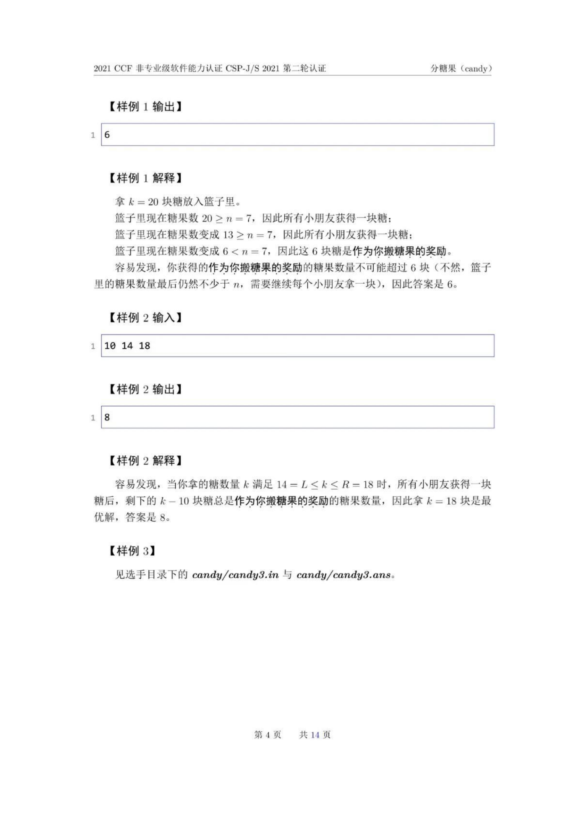

小明正在学习插入排序。给定一个长度为 n 的序列 a，初始为 a_1, a_2, ..., a_n，所有元素两两不同。

他需要处理 q 次操作，操作分为两种：

1. `1 i v`：将 a_i 修改为 v（保证修改后所有元素仍然两两不同）。
2. `2 i`：询问在当前序列中，如果对 a_i 执行插入排序，它会被插入到哪个位置（即它在当前序列中从小到大排序后的下标）。

#### 输入格式

第一行两个整数 n 和 q。

第二行 n 个整数 a_1, a_2, ..., a_n。

接下来 q 行，每行描述一个操作。

#### 输出格式

对于每个类型 2 的操作，输出一行一个整数，表示答案。

#### 样例输入

```
5 3
1 5 3 4 2
2 3
1 2 6
2 2
```

#### 样例输出

```
3
5
```

#### 数据范围与约定

- 1 ≤ n ≤ 8000
- 1 ≤ q ≤ 2 × 10^5
- 1 ≤ a_i, v ≤ 10^9
- 修改后所有元素两两不同

---

### T3 网络连接 (Network)

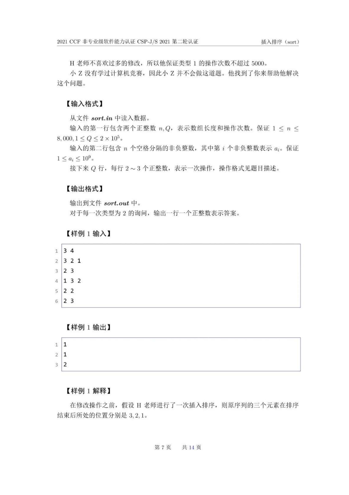

小明在管理一个计算机网络。网络中有若干台计算机，每台计算机有一个唯一的地址，格式为 `a.b.c.d:e`，其中 a, b, c, d 是 0~255 之间的整数，e 是 0~65535 之间的整数。

有以下两种操作：

- `Server addr`：在地址为 addr 的位置创建一台新的服务器。如果该地址已有服务器，则输出 "FAIL"；否则输出 "OK"。
- `Client addr`：尝试连接地址为 addr 的服务器。如果该地址有服务器，则输出 "OK"；否则输出 "FAIL"。

#### 输入格式

第一行一个整数 n，表示操作次数。

接下来 n 行，每行一个操作，格式为 `Operation addr`。

#### 输出格式

对于每个操作，输出一行 "OK" 或 "FAIL"。

#### 样例输入

```
5
Server 1.2.3.4:5
Server 1.2.3.4:5
Client 1.2.3.4:5
Client 1.2.3.4:6
Client 1.2.3.4:5
```

#### 样例输出

```
OK
FAIL
OK
FAIL
OK
```

#### 数据范围与约定

- 1 ≤ n ≤ 1000
- 地址格式合法

---

### T4 小熊的果篮 (Fruit)

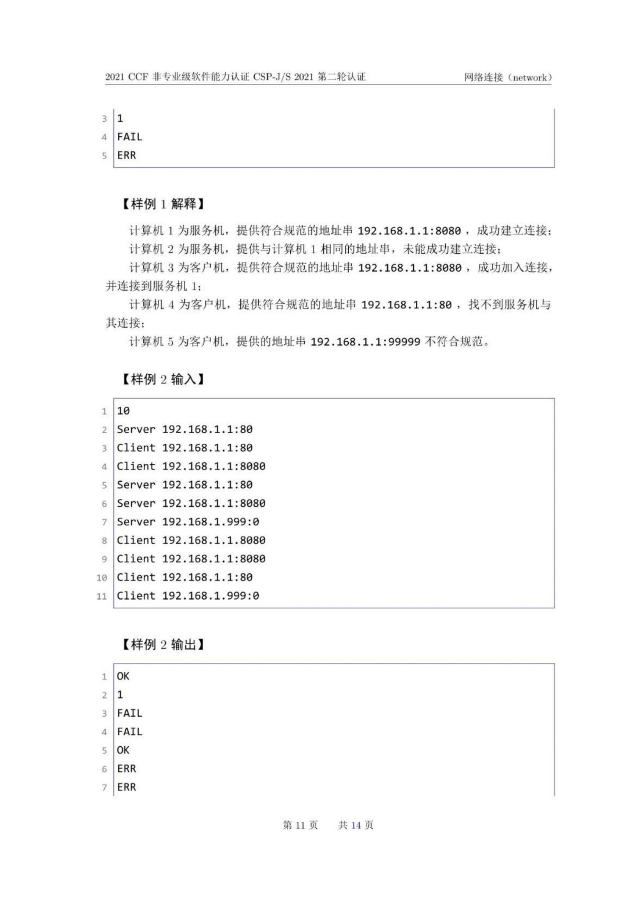

小熊有一个果篮，里面有 n 个水果排成一排。每个水果是苹果（用 0 表示）或橘子（用 1 表示）。

小熊每次取水果的规则如下：

1. 找到最长的连续相同水果段（即连续的 0 或连续的 1）。如果有多个最长段，取最左边的那个。
2. 从该段的第一个水果开始取。

取完后，该水果从果篮中移除，后面的水果依次前移。重复此过程直到果篮为空。

求小熊取水果的顺序。

#### 输入格式

第一行一个整数 n，表示水果数量。

第二行 n 个整数，表示果篮中水果的种类。

#### 输出格式

一行 n 个整数，表示取水果的顺序。

#### 样例输入

```
7
0 1 0 0 1 1 0
```

#### 样例输出

```
3 4 5 6 7 1 2
```

#### 数据范围与约定

- 1 ≤ n ≤ 2 × 10^5

---

## CSP-J 2022

### T1 乘方 (Pow)

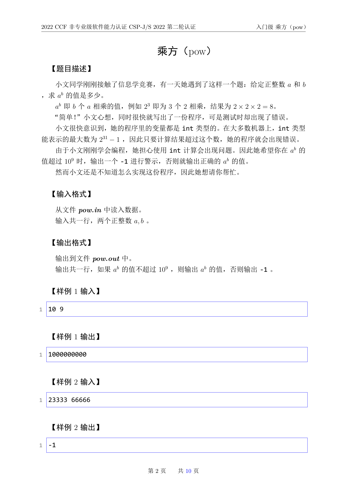

给定两个正整数 a 和 b，求 a^b 的值。如果结果超过 10^9，则输出 -1。

#### 输入格式

一行两个整数 a 和 b。

#### 输出格式

一行一个整数，表示 a^b 的值或 -1。

#### 样例输入1

```
2 10
```

#### 样例输出1

```
1024
```

#### 样例输入2

```
3 20
```

#### 样例输出2

```
-1
```

#### 数据范围与约定

- 1 ≤ a ≤ 10^9
- 0 ≤ b ≤ 10^9

---

## CSP-J 2023

### T1 小苹果 (Apple)

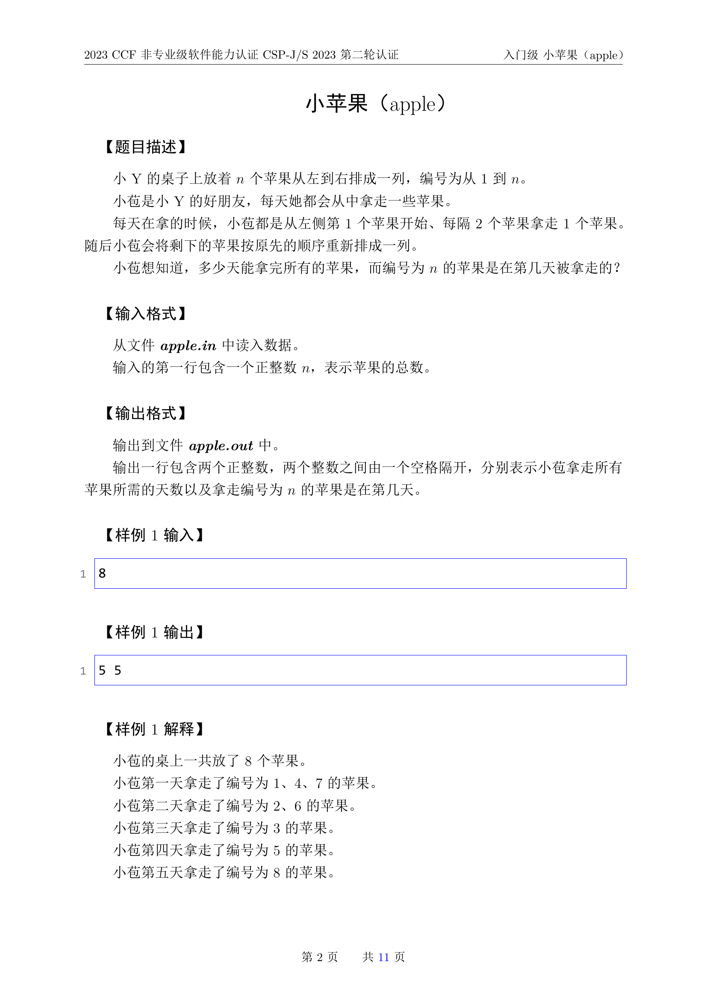

小明有 n 个苹果排成一排。他每天按照以下规则取苹果：

从第 1 个苹果开始，每隔 2 个苹果取 1 个（即取第 1、4、7、... 个苹果）。

被取走的苹果不再参与后续取苹果的过程。

求一共需要多少天才能取完所有苹果，以及第 n 个苹果（最后一个苹果）是在第几天被取走的。

#### 输入格式

一行一个整数 n，表示苹果数量。

#### 输出格式

一行两个整数，分别表示总天数和第 n 个苹果被取走的天数。

#### 样例输入

```
10
```

#### 样例输出

```
5 4
```

#### 数据范围与约定

- 1 ≤ n ≤ 10^9

---

## CSP-J 2024

### T1 扑克牌 (Poker)

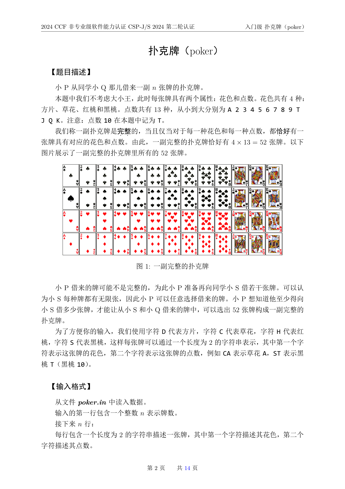

一副标准的扑克牌有 52 张（不含大小王），分为 4 种花色（黑桃、红心、梅花、方块），每种花色 13 张牌（A, 2, 3, ..., 10, J, Q, K）。

小明手中有 n 张牌。他想知道，最少还需要从牌堆中借几张牌，才能凑齐一副完整的 52 张牌。

#### 输入格式

第一行一个整数 n，表示小明手中的牌数。

接下来 n 行，每行两个字符串，分别表示花色和点数。

#### 输出格式

一行一个整数，表示最少还需要借几张牌。

#### 样例输入

```
5
Spade A
Heart 3
Diamond 10
Club K
Spade 7
```

#### 样例输出

```
47
```

#### 数据范围与约定

- 0 ≤ n ≤ 52
- 输入的牌两两不同，且均为合法的花色和点数

---

### T2 地图探险 (Explore)

有一个 n × m 的网格地图，每个格子要么是空地（可以走），要么是障碍物（不能走）。

一个机器人从位置 (x0, y0) 出发，初始朝向为 d（'U'=上, 'D'=下, 'L'=左, 'R'=右）。

机器人按照以下规则移动 k 步：

1. 如果前方一格是空地且在地图内，则向前走一格。
2. 否则，原地右转 90 度（不移动）。

求机器人经过的不同位置数（包括起点）。

#### 输入格式

第一行一个整数 T，表示数据组数。

每组数据：

- 第一行三个整数 n, m, k，分别表示地图的行数、列数、步数。
- 第二行两个整数 x0, y0 和一个字符 d0，表示起点坐标和初始方向。
- 接下来 n 行，每行 m 个字符，表示地图（'.'=空地，'#'=障碍物）。

#### 输出格式

对于每组数据，输出一行一个整数，表示机器人经过的不同位置数。

#### 样例输入

```
1
5 5 6
3 3 R
.....
.###.
.....
.###.
.....
```

#### 样例输出

```
5
```

#### 数据范围与约定

- 1 ≤ T ≤ 10
- 1 ≤ n, m ≤ 1000
- 1 ≤ k ≤ 10^6
- 起点为空地

---

## CSP-J 2025

### T1 拼数 (Number)

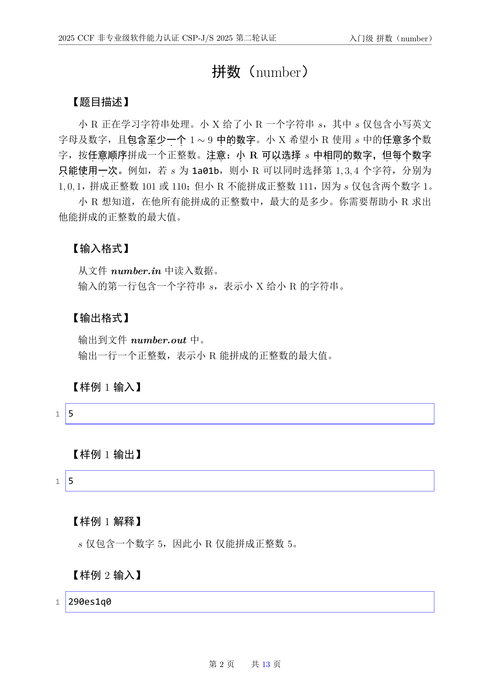

给定一个由数字字符组成的字符串 s。你可以从 s 中选择若干个数字字符（保持原有顺序），将它们拼接成一个正整数。

求能拼出的最大正整数。

#### 输入格式

一行一个字符串 s，仅由数字字符 '0'~'9' 组成。

#### 输出格式

一行一个整数，表示能拼出的最大正整数。

#### 样例输入

```
1023
```

#### 样例输出

```
321
```

#### 样例输入2

```
99900
```

#### 样例输出2

```
999
```

#### 数据范围与约定

- 1 ≤ |s| ≤ 10^6

---

### T2 座位 (Seat)

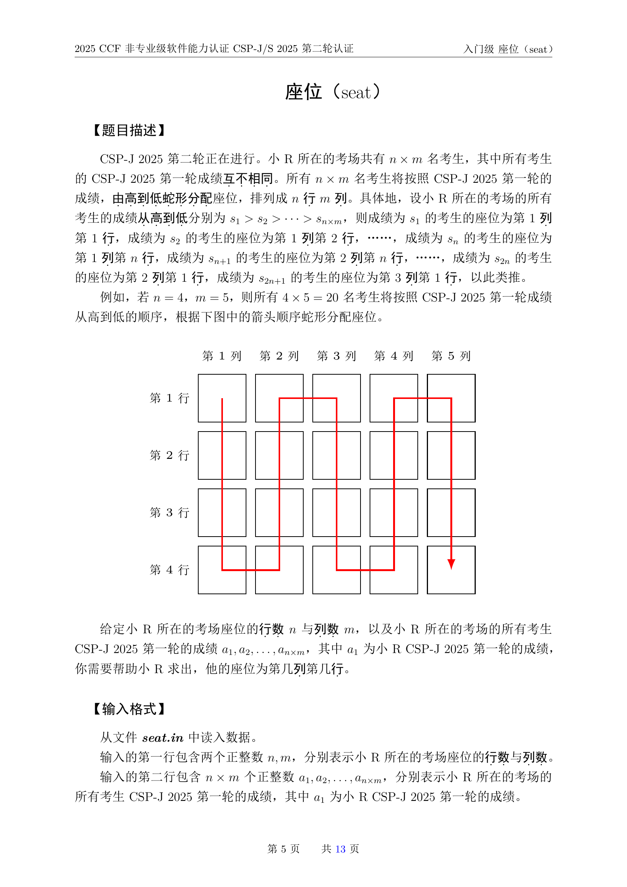

一个考场有 n 行 m 列共 n × m 个座位。考场按照以下规则分配座位：

1. 将所有考生按成绩从高到低排序。
2. 成绩最高的考生坐在第 1 行第 1 列。
3. 座位按照蛇形排列：第 1 行从左到右坐，第 2 行从右到左坐，第 3 行从左到右坐，以此类推。

给定 n, m 和所有考生的成绩，求成绩第 r 的考生（第 r 高的考生）坐在第几列（输出 c 行 r 列，即列号 c 和行号 r）。注意：如果两个考生成绩相同，按输入顺序排名靠前的排在前面。

#### 输入格式

第一行两个整数 n 和 m，分别表示座位的行数和列数。

接下来 n 行，每行 m 个整数，表示按座位顺序给出的每个位置上考生的成绩（未排序前的座位分配）。

#### 输出格式

一行两个整数 c 和 r，表示目标考生的列号和行号。

#### 样例输入

```
2 3
90 85 88
80 75 82
```

#### 样例输出

```
1 2
```

#### 数据范围与约定

- 1 ≤ n, m ≤ 10
- 成绩为 0~100 的整数
