# GESP Scratch二级 编程题汇总

---

## 2026年3月（GESP二级202603-真题）

### 1. 交朋友

**题目描述**

小杨喜欢和同学们交朋友。班级里有三位小朋友，他们的身高分别是 H1、H2 和 H3，其中小杨的身高是 H1。

小杨想找一位身高和自己最接近的小朋友做朋友。如果有多位小朋友的身高和小杨同样接近，善良的小杨会选择其中较矮的那位，因为他觉得这样一起玩耍更轻松。

默认小猫角色和白色背景，请你编写一个程序，帮助小杨找出这位朋友的身高是多少吧！最后输出的答案存入变量 ans 中。

**输入描述**

新建变量"H1"，"H2"和"H3"，依次表示三位小朋友的身高。其中"H1"是小杨的身高。
注意：三位小朋友的身高互不相同且所有身高都是 100 到 199 之间的整数。

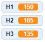

**输出描述**

新建变量"ans"用于存储最后的结果。


**样例解释**

针对上面的数据：小杨的身高是 150。
第二位小朋友身高 165，与 150 相差 15。
第三位小朋友身高 135，与 150 也相差 15。
两位小朋友与小杨的身高差距相同，小杨选择较矮的那位，所以选择身高 135 的第三位小朋友。

**输入样例1**

```
H1 = 150
H2 = 165
H3 = 135
```

**输出样例1**

```
ans = 135
```

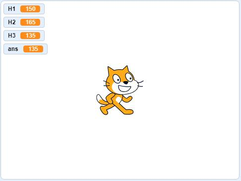

**输入样例2**

```
H1 = 150
H2 = 160
H3 = 165
```

**输出样例2**

```
ans = 160
```

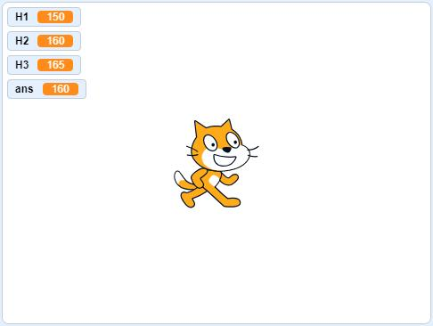

**参考程序（Scratch）**

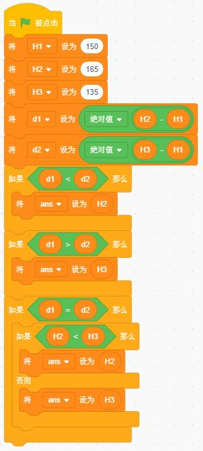

---

### 2. 数字替换

**题目描述**

小杨最近迷上了数字游戏。他觉得数字 8 看起来像两个叠在一起的甜甜圈，非常有趣；而数字 4 让他联想到不太喜欢的酸柠檬。于是，小杨想出了一个好玩的游戏规则：把任意一个数字中所有的数字 4 都替换成 8，如果数字中没有 4，就保持原样不变。

默认小猫角色和白色背景，请你编写一个程序，帮助小杨完成这个有趣的数字替换游戏吧！最后输出的答案存入变量 ans 中。

**输入描述**

新建变量"A"，表示小杨要处理的数字。
注意：0 < A ≤ 100,000,000（数字最长不超过 9 位）。


**输出描述**

新建变量"ans"用于存储最后的结果。


**样例解释**

数字 8459045 里有两个 4，把它们都替换成 8 后，就变成了 8859085。

**输入样例1**

```
A = 8459045
```

**输出样例1**

```
ans = 8859085
```

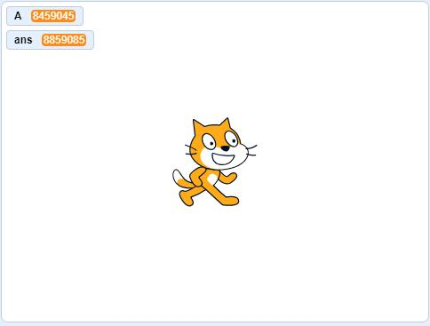

**输入样例2**

```
A = 123
```

**输出样例2**

```
ans = 123
```

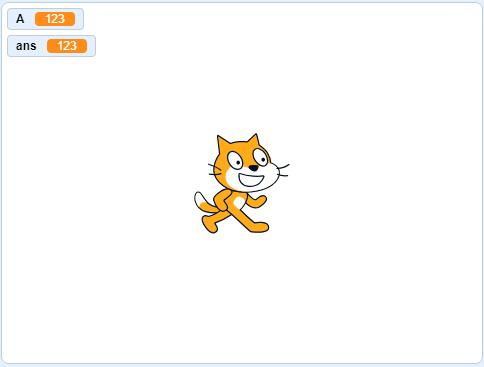

**参考程序（Scratch）**

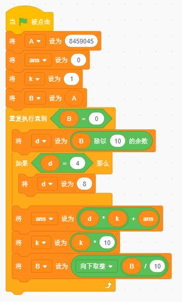


## 2025年12月（GESP二级202512-真题）

### 1. 手机电量显示大挑战

**题目描述**

小杨的手机就像一个聪明的小助手，当电量变化时，它会用不同的方式来提醒我们：
- 当电量非常低（不超过 10%），它会显示一个大写字母 R，就像在说："快给我充电吧！（Red 警告色）"
- 当电量有点低（超过 10%但不超过 20%），它会显示一个大写字母 L，意思是"电量有点 Low 啦！"
- 当电量比较充足（超过 20%），它就会直接显示具体的数字，比如直接显示 50，表示还有 50%的电量。

默认小猫角色和白色背景，编写程序，模仿小杨手机的这个功能。根据电量百分比的数字 x，输出手机应该显示的信息存入变量 ans 中。

**输入描述**

新建变量"x"，表示电量百分比，范围是 1 到 100 之间的整数。


**输出描述**

新建变量"ans"用于存储最后的结果。


**输入样例1**

```
x = 10
```

**输出样例1**

```
ans = R
```


**输入样例2**

```
x = 99
```

**输出样例2**

```
ans = 99
```


**参考程序（Scratch）**

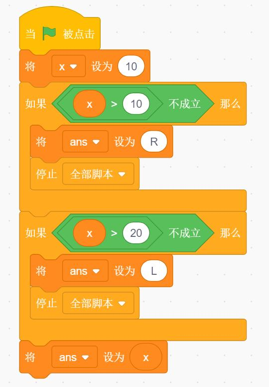

---

### 2. 小杨的爱心快递

**题目描述**

小杨是"爱心社区"的小志愿者，每周他都会帮助邻居们寄送捐赠给山区小学的文具和书籍。快递公司为了支持公益行动，制定了特殊的运费规则，鼓励大家合理包装：

1. 按体积计算：如果包裹比较蓬松（比如装了很多泡沫纸保护文具），运费按体积计算，公式是 体积（V）÷ 2。
2. 按重量计算：如果包裹比较结实沉重，运费按重量计算。为了鼓励减轻包裹重量，规则是：当重量（G）小于 300 克时，运费为 M 元；当重量（G）达到或超过 300 克时，运费为 N 元。

快递公司的叔叔说："我们应该选择最公平合理的计费方式。"所以，最终的运费会取按体积计算和按重量计算这两种方式中价格较低的那一个，这样对寄件人最公道。

默认小猫角色和白色背景，编写程序帮助小杨快速计算出每份爱心快递的运费，最后输出的答案存入变量 ans 中。

**输入描述**

新建变量"V"，表示快递的体积（单位：立方厘米）。
新建变量"G"，表示快递的重量（单位：克）。
新建变量"M"，表示重量较轻时（G < 300）的运费（单位：元）
新建变量"N"，表示重量较重时（G ≥ 300）的运费（单位：元）
注意：所有输入的数字都是不超过 1000 的正整数。

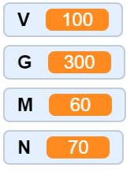

**输出描述**

新建变量"ans"用于存储最后的结果。


**输入样例1**

```
V = 100
G = 300
M = 60
N = 70
```

**输出样例1**

```
ans = 50
```


**输入样例2**

```
V = 99
G = 200
M = 60
N = 70
```

**输出样例2**

```
ans = 49.5
```


**参考程序（Scratch）**

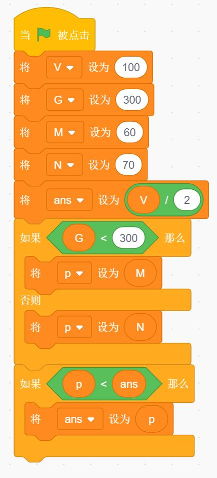


## 2025年9月（GESP二级202509-真题）

### 1. 商店折扣

**题目描述**

小杨去商店买东西，商店老板给了他两种优惠方式，只能选用一种。

第一种：满额减钱
规则：如果买东西的总价钱达到或超过 x 元，就可以立刻减掉 y 元。
注意，这个优惠只能用一次。比如，规定"满 10 元减 3 元"，如果你买了 33 元的东西，也只能减 3 元，最后付 30 元。

第二种：直接打折
规则：所有东西直接按 n 折计算。打 n 折的意思就是，原来卖 10 元的东西，现在只卖 n 元（因为 n 折就是原价的 n/10）。

小杨选好了一些东西，总价是 p 元，默认小猫角色和白色背景，编写程序帮他算一算，用哪种优惠方式付的钱更少，为多少元？最后输出的答案存入变量 ans 中。

**输入描述**

新建变量"x"，表示满减优惠的门槛金额。
新建变量"y"，表示满减优惠的减免金额（1≤y＜x≤100）。
新建变量"n"，表示打折优惠的折扣力度（1≤n＜10）。
新建变量"p"，表示商品总价（1≤p≤100）。

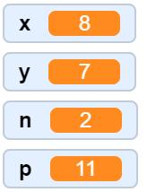

**输出描述**

新建变量"ans"用于存储最后的结果。


**输入样例1**

```
x = 8
y = 7
n = 2
p = 11
```

**输出样例1**

```
ans = 2.2
```

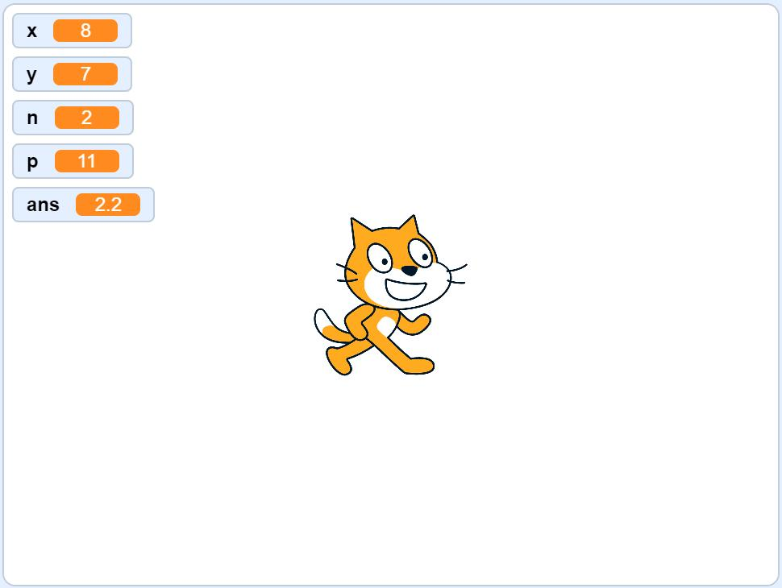

**输入样例2**

```
x = 8
y = 7
n = 9
p = 10
```

**输出样例2**

```
ans = 3
```

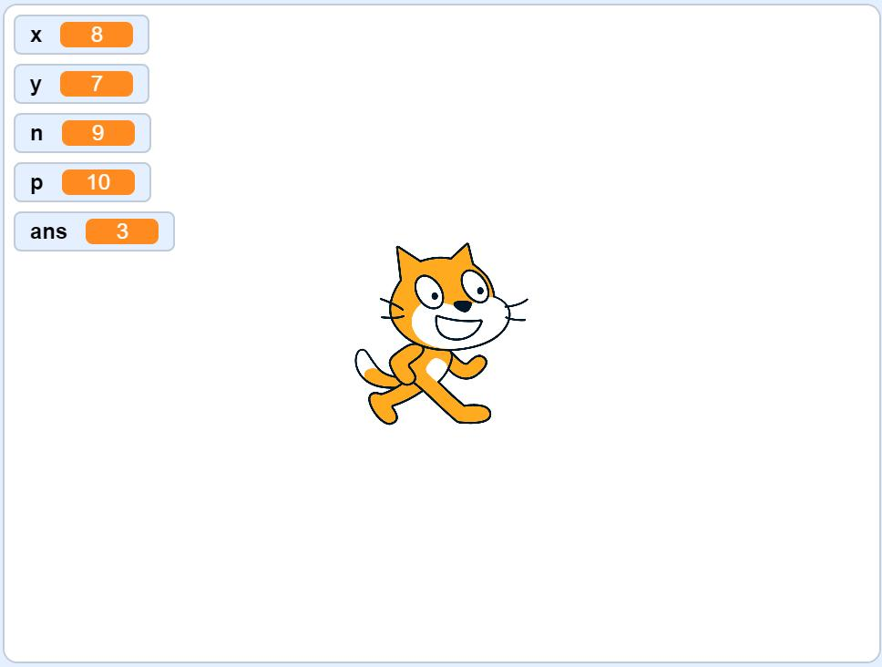

**参考程序（Scratch）**

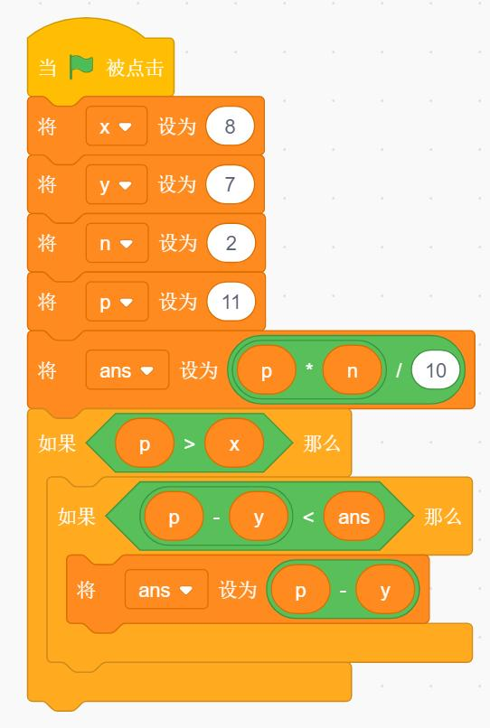

---

### 2. 金字塔

**题目描述**

小杨喜欢用积木搭房子，今天他想搭一个金字塔！这个金字塔的搭建规则是这样的。

金字塔从上往下：
第一层需要：1×1 块积木
第二层需要：2×2 块积木
…
最底层（第 n 层）需要：n×n 块积木

小杨希望搭建 n 层的金字塔，默认小猫角色和白色背景，编写程序帮小杨计算搭建这个金字塔一共需要多少块积木？最后输出的答案存入变量 ans 中。

**输入描述**

新建变量"n"，表示金字塔的层数（1≤n≤50）。


**输出描述**

新建变量"ans"用于存储最后的结果。


**输入样例1**

```
n = 2
```

**输出样例1**

```
ans = 5
```


**输入样例2**

```
n = 5
```

**输出样例2**

```
ans = 55
```

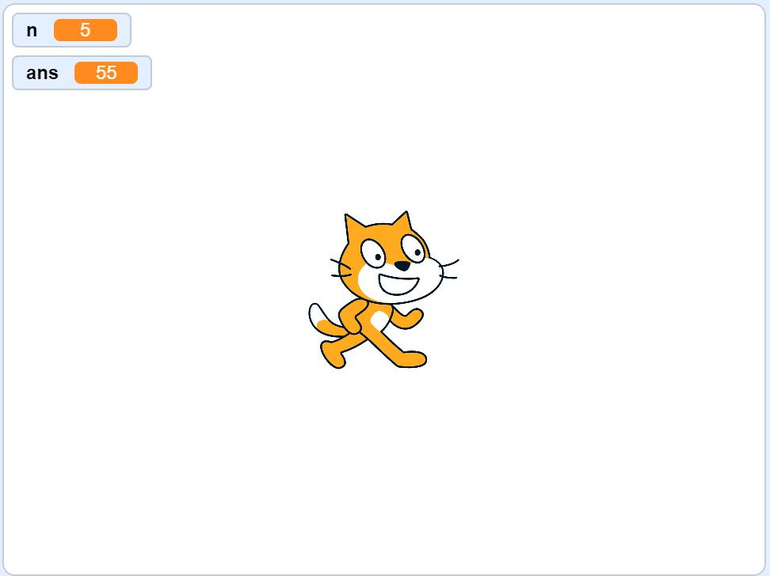

**参考程序（Scratch）**

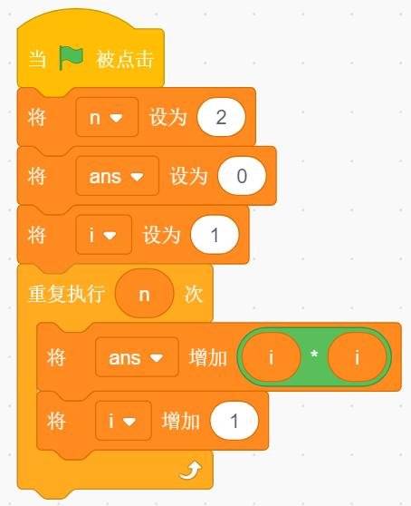


## 2025年6月（GESP二级202506-真题）

### 1. 假期阅读

**题目描述**

小杨有一本厚厚的书。这本书总共有 n 页，小杨每天最多阅读 k 页。小杨的假期总共有 t 天，他想知道在假期中最多能阅读这本书的多少页。

默认小猫角色和白色背景，编写程序实现上述功能。

**输入描述**

新建变量"n"，表示书的页数。
新建变量"k"，表示小杨每天最多阅读的页数。
新建变量"t"，表示小杨假期的天数。

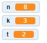

**输出描述**

新建变量"result"用于存储最后的结果。


**输入样例1**

```
n = 8
k = 3
t = 2
```

**输出样例1**

```
result = 6
```

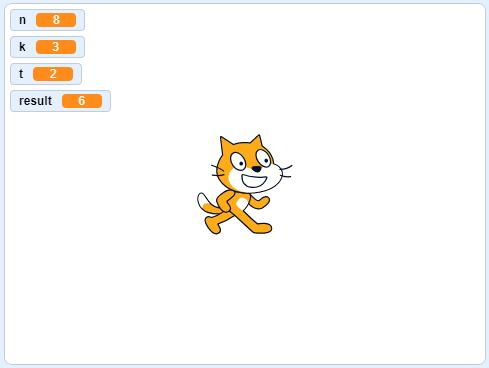

**输入样例2**

```
n = 19
k = 3
t = 30
```

**输出样例2**

```
result = 19
```

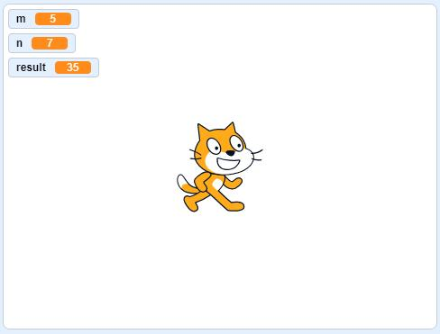

**参考程序（Scratch）**

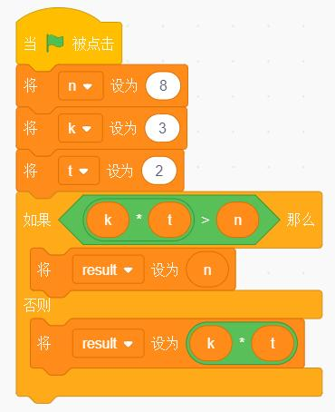

---

### 2. 值日

**题目描述**

小杨和小红是值日生，负责打扫教室。小杨每 m 天值日一次，小红每 n 天值日一次。今天他们同时值日，请问最少需要多少天后，他们会再次同一天值日？

默认小猫角色和白色背景，编写程序实现上述功能。

**输入描述**

新建变量"m"，表示小杨的值日周期。
新建变量"n"，表示小红的值日周期。

**输出描述**

新建变量"result"用于存储最后的结果。

**输入样例1**

```
m = 4
n = 6
```

**输出样例1**

```
result = 12
```


**输入样例2**

```
m = 5
n = 7
```

**输出样例2**

```
result = 35
```


**参考程序（Scratch）**

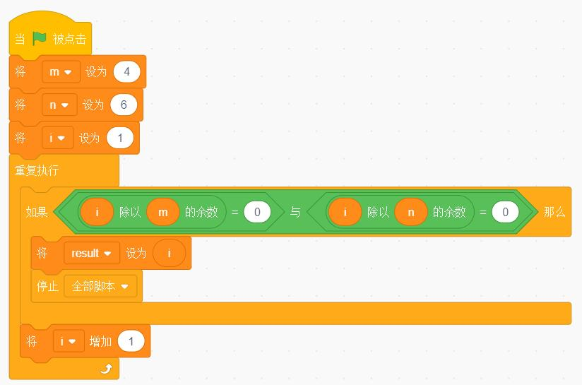


## 2025年3月（GESP二级202503-真题）

### 1. 图书馆里的老鼠

**题目描述**

图书馆里面有 n 本书。不幸的是，图书馆里混进了一只老鼠。老鼠每 x 小时能啃坏一本书，假设老鼠在啃坏一本书之前不会啃另一本。

默认小猫角色和白色背景，编写程序计算经过 y 小时，图书馆还有多少本完好的书。

**输入描述**

新建变量"n"，用于存储书的数量。
新建变量"x"，用于存储老鼠啃坏一本书的时间。
新建变量"y"，用于存储经过的小时数。
输入数据保证 y ≤ n×x。

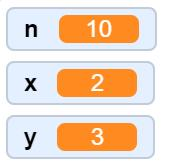

**输出描述**

新建变量"result"用于存储最后的结果。

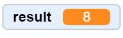

**输入样例1**

```
n = 10
x = 2
y = 3
```

**输出样例1**

```
result = 8
```

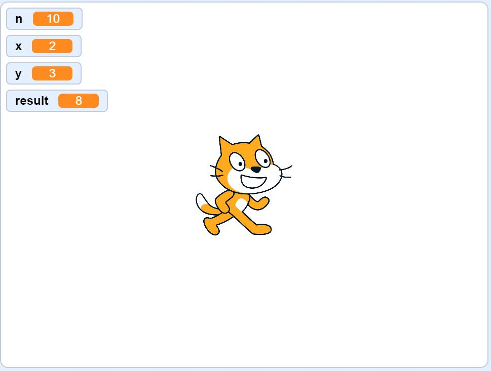

**输入样例2**

```
n = 5
x = 2
y = 4
```

**输出样例2**

```
result = 3
```

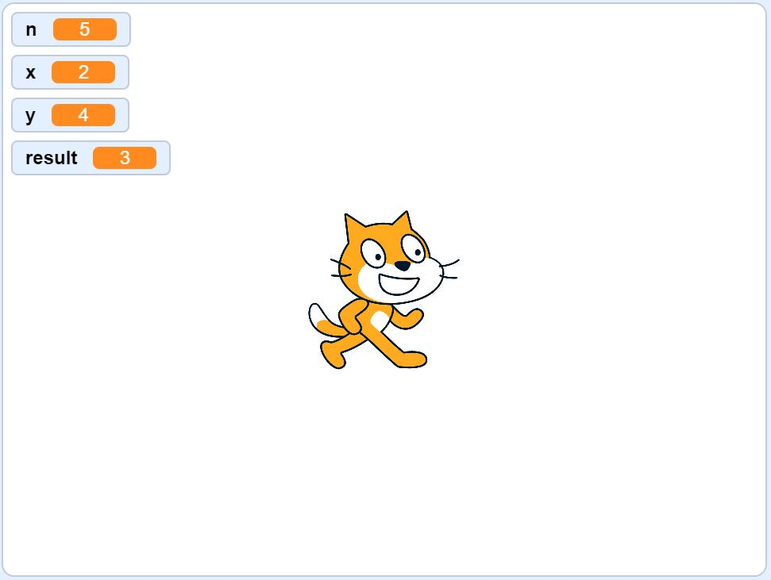

**参考程序（Scratch）**

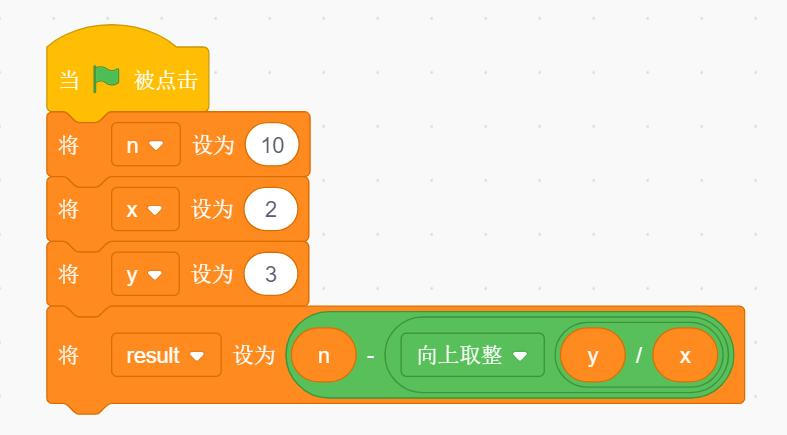

---

### 2. 数字变换游戏

**题目描述**

默认小猫角色和白色背景，输入一个正整数 n（1≤n≤100），按照如下规则进行变换，算出第 k 次变换后的数是多少？

规则：从 n 开始，如果 n 是偶数，n 变换为 n 除以 2 的数，如果 n 是奇数，n 变换为 n 加上 3 的数。

**输入描述**

新建变量"n"用于存储一个正整数。
新建变量"k"用于存储变换的次数。

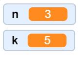

**输出描述**

输出变换后的数。

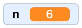

**输入样例1**

```
n = 3
k = 5
```

**输出样例1**

```
n = 6
```


**输入样例2**

```
n = 10
k = 4
```

**输出样例2**

```
n = 2
```

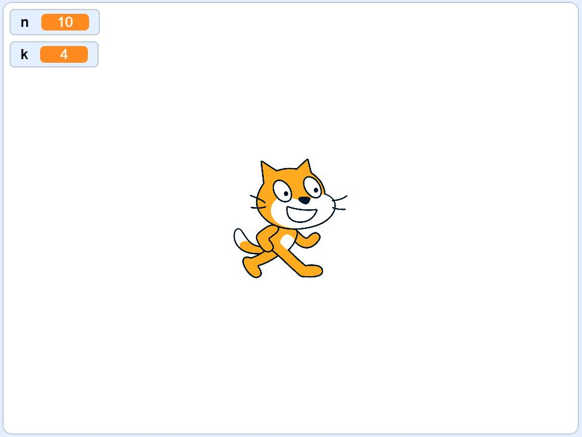

**参考程序（Scratch）**

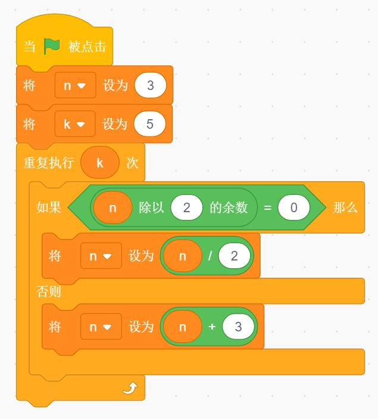


## 2024年12月（GESP二级202412-真题）

### 1. 温度转换

**题目描述**

小杨最近学习了开尔文温度、摄氏温度和华氏温度的转换。令符号 K 表示开尔文温度，符号 C 表示摄氏温度，符号 F 表示华氏温度，这三者的转换公示如下：

C = K - 273.15
F = C × 1.8 + 32

默认白色背景，小猫角色，编写一个程序帮小杨计算某一开尔文温度对应的华氏温度？

**输入描述**

新建变量"K"用于存储开尔文温度（0 < K < 1000）。


**输出描述**

新建变量"result"用于存储最后的结果，若输入开尔文温度，计算出来的华氏温度高于 212，result 存入 too high，否则存入计算出来的华氏温度。要求存入的华氏温度先×10，四舍五入后再÷10，即精确到一位小数。


**输入样例1**

```
K = 412
```

**输出样例1**

```
result = too high
```

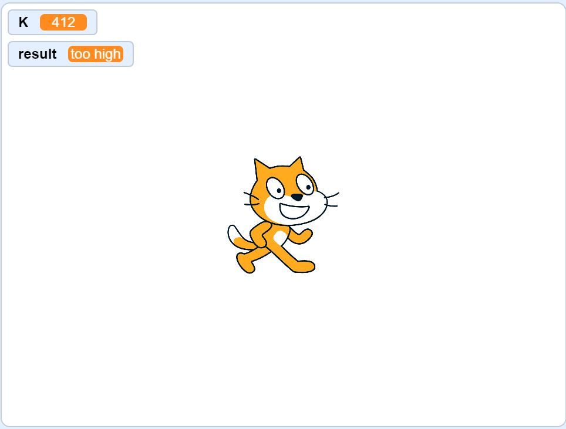

**输入样例2**

```
K = 315
```

**输出样例2**

```
result = 107.3
```


**参考程序（Scratch）**

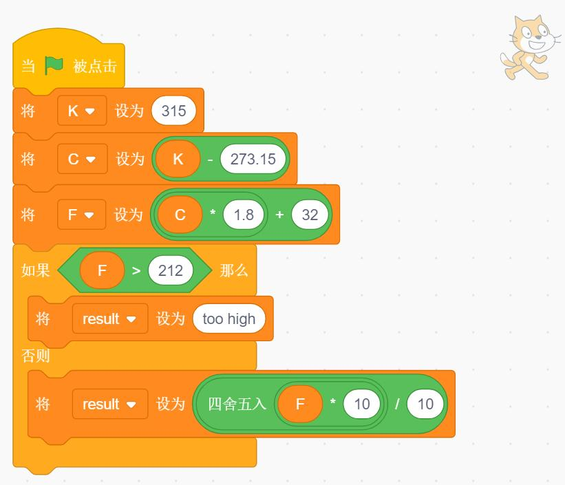

---

### 2. 小杨读书

**题目描述**

小杨每天读故事书的页数逐渐增加。他第一天读了 1 页，第二天读了 3 页，以此类推，每天比前一天多读 2 页。

默认小猫角色和白色背景，编写程序计算小杨连续读了 n 天，他一共读了多少页书。

**输入描述**

新建变量"n"用于存储连续读书的天数。1≤n≤100。

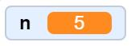

**输出描述**

新建变量"result"用于存储计算结果。


**输入样例1**

```
n = 3
```

**输出样例1**

```
result = 9
```

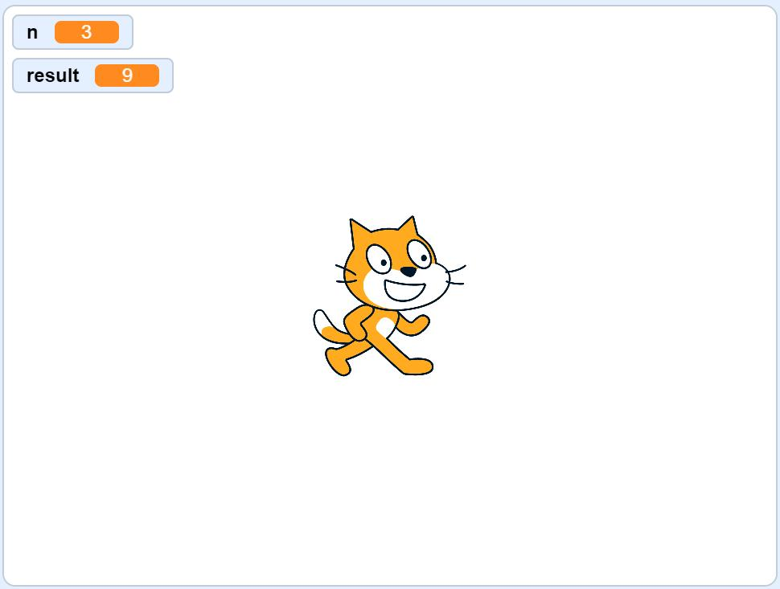

**输入样例2**

```
n = 5
```

**输出样例2**

```
result = 25
```

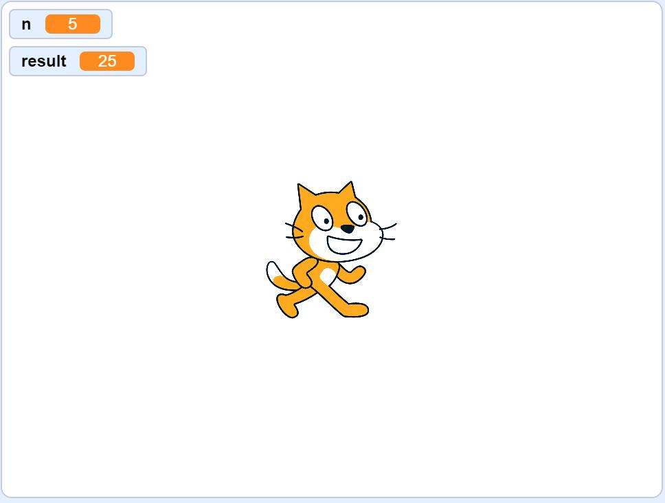

**参考程序（Scratch）**

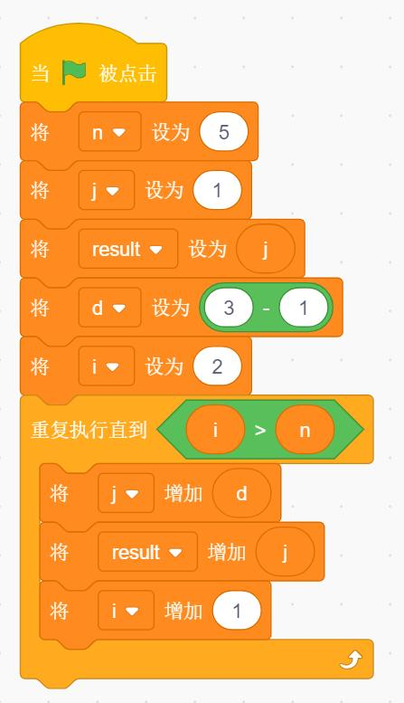


## 2024年9月（GESP二级202409-真题）

### 1. 小杨购物

**题目描述**

小杨有 n 元钱用于购物。商品 A 的单价是 a 元，商品 B 的单价是 b 元。

小杨想购买相同数量的商品 A 和商品 B。
默认小猫角色和白色背景，编写程序请你帮小杨计算出他最多能够购买多少个商品 A 和商品 B。

**输入描述**

新建变量"n"用于存储小杨购物的金额。
新建变量"a"用于存储商品 A 的价格。
新建变量"b"用于存储商品 B 的价格。
1≤n，a，b≤100000。

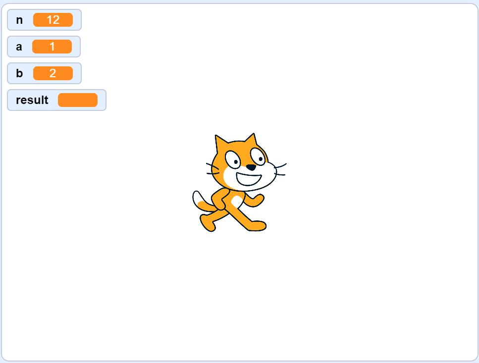

**输出描述**

新建变量"result"用于存储小杨最多购买商品 A 和商品 B 的个数。

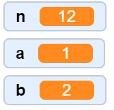

**输入样例1**

```
n = 12
a = 1
b = 2
```

**输出样例1**

```
result = 4
```


**输入样例2**

```
n = 13
a = 1
b = 2
```

**输出样例2**

```
result = 4
```

**参考程序（Scratch）**

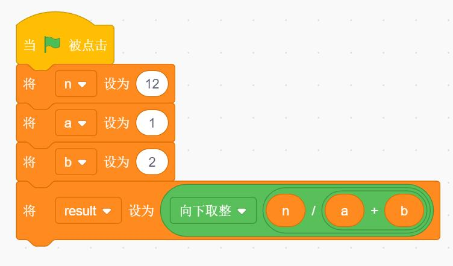

---

### 2. 计算 aⁿ

**题目描述**

给出一个整数 a 和一个正整数 n，求乘方 aⁿ。

aⁿ 就是 n 个 a 相乘，例如：2³ = 2×2×2 = 8。

默认小猫角色和白色背景，编写程序计算 aⁿ。

**输入描述**

新建变量"a"用于存储底数。-100≤a≤100。
新建变量"n"用于存储指数。1≤n≤100。


**输出描述**

新建变量"result"用于存储计算结果。

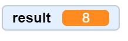

**输入样例1**

```
a = 2
n = 3
```

**输出样例1**

```
result = 8
```


**输入样例2**

```
a = 3
n = 4
```

**输出样例2**

```
result = 81
```


**参考程序（Scratch）**

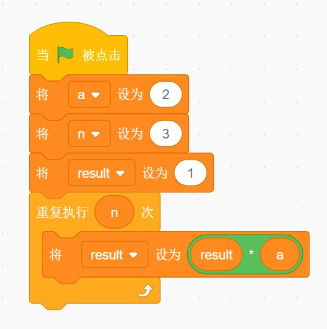


## 2024年6月（GESP二级202406-真题）

### 1. 休息时间

**题目描述**

小杨计划在某个时刻开始学习，并决定在学习 k 秒后开始休息。
小杨想知道自己开始休息的时刻是多少。
默认小猫角色和白色背景，编写程序请你帮他完成休息时刻的计算。

**输入描述**

新建变量"h"用于存储小杨开始学习时刻的时（1≤h≤12）。
新建变量"m"用于存储小杨开始学习时刻的分（0≤m≤59）。
新建变量"s"用于存储小杨开始学习时刻的秒（0≤s≤59）。
新建变量"k"用于存储小杨学习的总秒数（1≤k≤3600）。


**输出描述**

新建变量"h1"用于存储小杨开始休息时刻的时。
新建变量"m1"用于存储小杨开始休息时刻的分。
新建变量"s1"用于存储小杨开始休息时刻的秒。

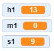

**输入样例1**

```
h = 12
m = 59
s = 59
k = 10
```

**输出样例1**

```
h1 = 13
m1 = 0
s1 = 9
```

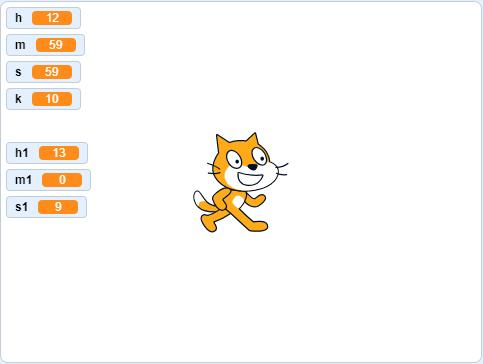

**参考程序（Scratch）**

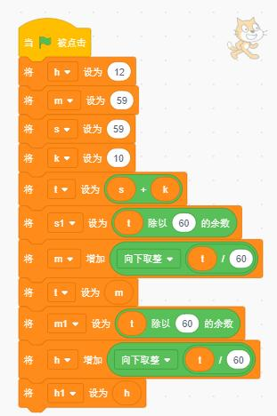

---

### 2. 整数的立方和

**题目描述**

默认小猫角色和白色背景。
给定一个正整数 k（1<k<25），编写程序计算 1 到 k 的立方和，存入 result。

result = 1³ + 2³ + … + k³。

**输入描述**

新建变量"k"用于存储一个正整数（1<k<25）。


**输出描述**

新建变量"result"用于存储 1 到 k 的立方和。


**输入样例1**

```
k = 3
```

**输出样例1**

```
result = 36
```

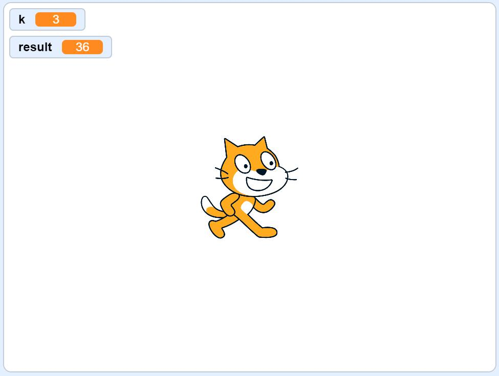

**输入样例2**

```
k = 5
```

**输出样例2**

```
result = 225
```

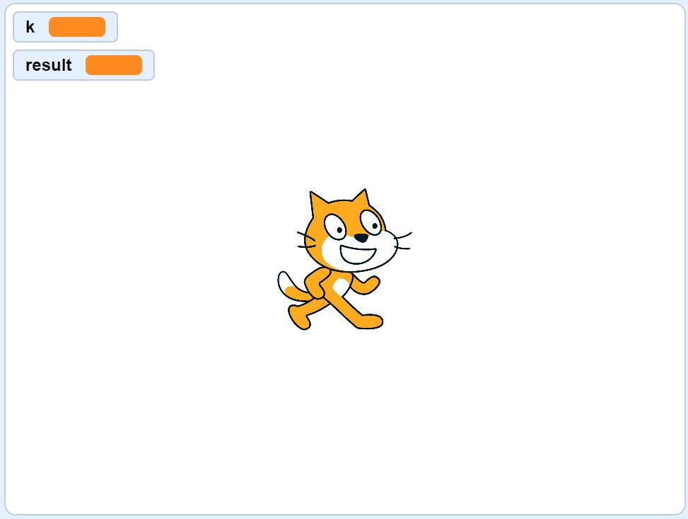

**参考程序（Scratch）**

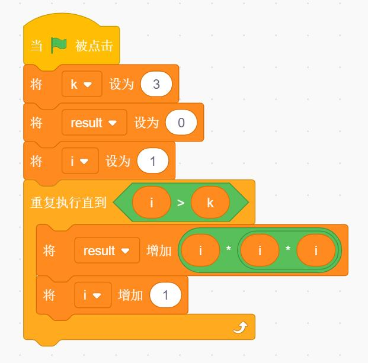


## 2024年3月（GESP二级202403-真题）

### 1. 小杨买书

**题目描述**

默认小猫角色和白色背景。
小杨同学积攒了一部分零用钱想要用来购买书籍，已知一本书的单价是 13 元，请根据小杨零用钱的金额，编写程序计算最多可以购买多少本书，还剩多少零用钱。

**输入描述**

新建变量"m"表示小杨拥有的零用钱数（0<m<200）。


**输出描述**

新建变量"b"和"r"，分别表示购买图书的本数和剩余的零用钱数。

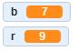

**输入样例1**

```
m = 100
```

**输出样例1**

```
b = 7
r = 9
```

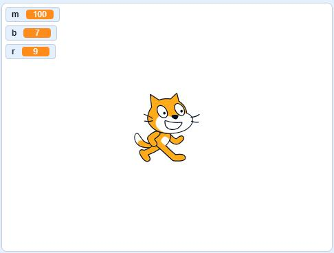

**输入样例2**

```
m = 199
```

**输出样例2**

```
b = 15
r = 4
```

**参考程序（Scratch）**

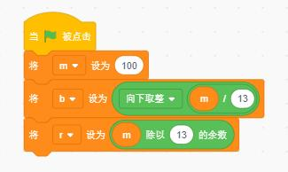

---

### 2. 找因数

**题目描述**

默认小猫角色和白色背景。
小杨最近刚刚学习了因数的概念，具体来说，如果一个正整数 a 可以被另一个正整数 b 整除，那么我们就说 b 是 a 的因数。
请你帮忙写一个程序，计算正整数 a 有多少个因数，存入变量 result 中。

**输入描述**

新建变量"a"，用于存储计算因数个数的变量（a ≤ 1,000）。

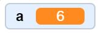

**输出描述**

新建变量"result"，用于存储 a 的因数个数。


**输入样例1**

```
a = 6
```

**输出样例1**

```
result = 4
```

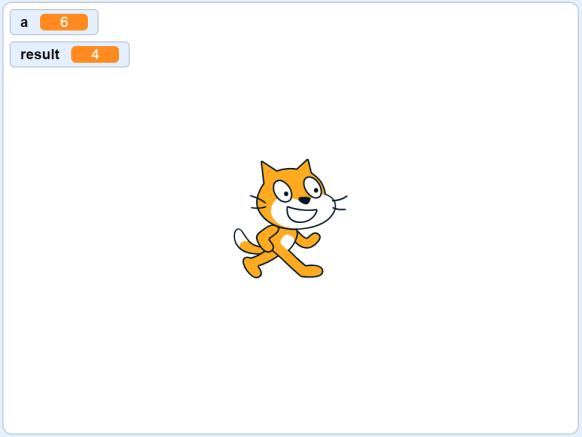

**输入样例2**

```
a = 1
```

**输出样例2**

```
result = 1
```

**参考程序（Scratch）**

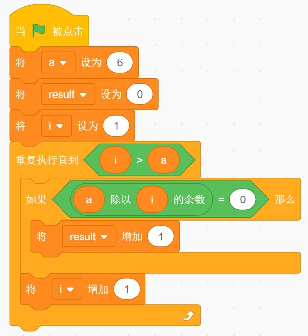


## 2023年12月（GESP二级202312-真题）

### 1. 足球联赛积分

**题目描述**

默认小猫角色和白色背景。
在足球联赛里，一个球队赢下一场比赛得到 3 个积分，打平一场比赛得到 1 个积分，输掉比赛得到 0 分。
现已知一个球队在整个联赛里的比赛情况，求该球队最终的积分。

**输入描述**

新建变量"x"，"y"，"z"分别表示这个球队赢下的比赛场数，打平的比赛场数，输掉的比赛场数。（0≤x,y,z≤40）。

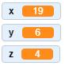

**输出描述**

新建变量"result"，一个整数，表示该球队最终的积分。


**输入样例1**

```
x = 19
y = 6
z = 4
```

**输出样例1**

```
result = 63
```


**输入样例2**

```
x = 3
y = 26
z = 20
```

**输出样例2**

```
result = 35
```

**参考程序（Scratch）**

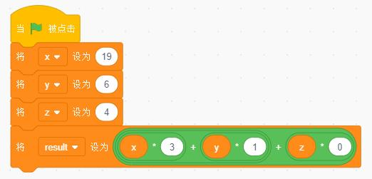

---

### 2. 小杨报数

**题目描述**

小杨需要从 1 到 N 报数。在报数过程中，小杨希望跳过 M 的倍数。例如，如果 N=5，M=2，那么小杨就需要依次报出 1，3，5。

默认小猫角色和白色背景，编写程序计算小杨报数的和。

**输入描述**

新建变量"N"（1≤N≤500）。
新建变量"M"（2≤M≤50）。


**输出描述**

新建变量"result"，用于存储报数的和。


**输入样例1**

```
N = 5
M = 2
```

**输出样例1**

```
result = 9
```

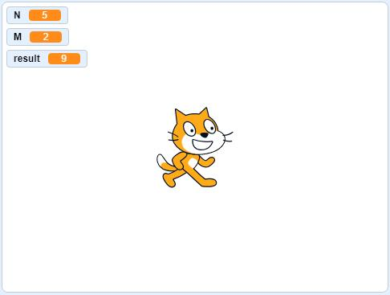

**输入样例2**

```
N = 5
M = 20
```

**输出样例2**

```
result = 15
```

**参考程序（Scratch）**

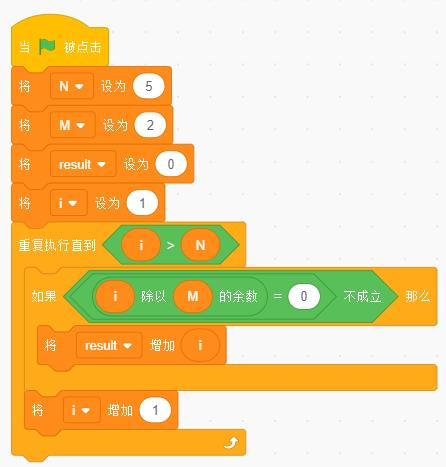
