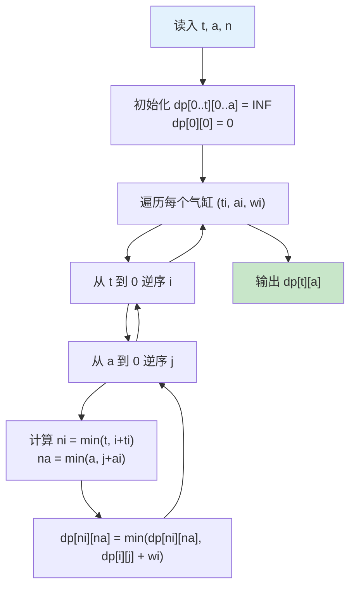
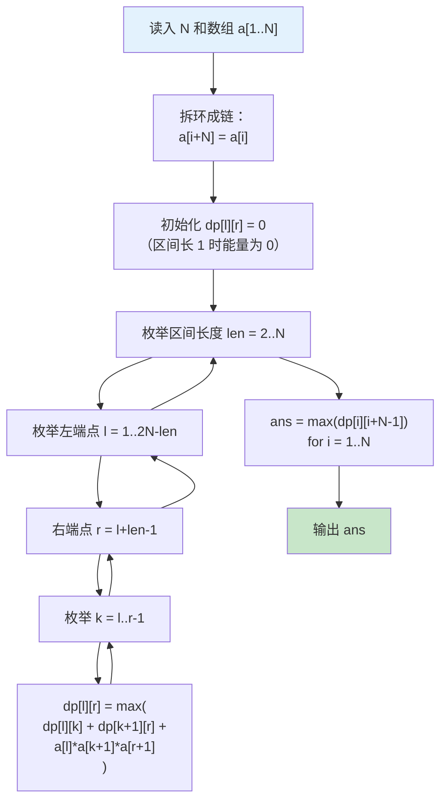

# 题解：潜水员 & 能量项链

> 袁雨同学，这两道题都是 DP，但类型不同。潜水员是**二维费用背包**，能量项链是**环形区间 DP**。放在一起看，恰好对比两类 DP 的思考方式。

---

## P1123 潜水员

### 题意简述

潜水员需要至少 $t$ 升氧气、$a$ 升氮气。有 $n$ 个气缸，每个含氧 $t_i$ 升、氮 $a_i$ 升、重 $w_i$。求满足要求的最小总重。

### 直觉入口

第一反应：这不就是背包吗？氧气和氮气是两种「费用」，重量是「价值」，求最小价值。

但普通背包是「不超过容量」，这里是**「至少达到」**某数值。方向反了怎么办？

### 关键转折——至少型背包

普通 01 背包：

```
dp[i][j] = min(dp[i][j], dp[i-ti][j-ai] + wi)   // 恰好型
```

「恰好型」初始化 `dp[0][0]=0`，其余 INF。转移时下标减。但本题要**「至少」**，意味着：
- 氧气超过 $t$ 也算满足（多余不浪费）
- 氮气超过 $a$ 也算满足

**处理技巧**：转移时把超出部分「截断」回上限。

```
ni = min(t, i + ti)
na = min(a, j + ai)
dp[ni][na] = min(dp[ni][na], dp[i][j] + wi)
```

截断的意义：既然多余上限的部分和达到上限等价，干脆统一归到上限状态。这样最终答案就是 `dp[t][a]`。

**数值举例**：

```
t=5, a=60, 一个气缸 (ti=10, ai=25, wi=129)
从 dp[0][0]=0 出发：
  ni = min(5, 0+10) = 5
  na = min(60, 0+25) = 25
  dp[5][25] = min(INF, 0+129) = 129
```

氧气从 0 到 10，截断到 5，表示「氧气已够，多出的不算浪费」。

### 算法流程



### 代码

```cpp
#include <iostream>
#include <cstring>
#include <algorithm>
using namespace std;

const int MAXT = 25, MAXA = 85;
int dp[MAXT][MAXA];   // dp[i][j] = 至少 i 氧 j 氮的最小重量

int main() {
    int t, a, n;
    cin >> t >> a >> n;

    // 初始化无穷大
    memset(dp, 0x3f, sizeof(dp));
    dp[0][0] = 0;

    for (int k = 0; k < n; k++) {
        int ti, ai, wi;
        cin >> ti >> ai >> wi;

        // 逆序枚举，保证每个气缸只用一次（01 背包）
        for (int i = t; i >= 0; i--) {
            for (int j = a; j >= 0; j--) {
                // 超出上限的部分截断
                int ni = min(t, i + ti);
                int na = min(a, j + ai);
                dp[ni][na] = min(dp[ni][na], dp[i][j] + wi);
            }
        }
    }

    cout << dp[t][a] << endl;
    return 0;
}
```

**关键行注释**：

| 行 | 说明 |
|----|------|
| `memset(dp, 0x3f, ...)` | 0x3f3f3f3f 作 INF，不易溢出且可做加法 |
| `for (int i = t; i >= 0; i--)` | 逆序保证 01 背包（每个气缸只取一次） |
| `ni = min(t, i + ti)` | 截断技巧，将「至少」转化为「恰好」 |

### 复杂度

- **时间**：$O(n \times t \times a) = 1000 \times 21 \times 79 \approx 1.66 \times 10^6$，轻松通过
- **空间**：$O(t \times a) = 21 \times 79$，极小

### 常见陷阱

1. **用「不超过」的思路做「至少」**：普通背包 `dp[i-ti][j-ai]` 会导致下标越界或漏解。记住要截断到上限。
2. **没有逆序枚举**：变成完全背包，同一个气缸被多次使用。
3. **INF 不够大**：用 `0x3f3f3f3f` 而非 `INT_MAX`，避免加法溢出。

---

## P1010 能量项链

### 题意简述

$N$ 颗珠子串成环形项链。每颗珠子有头标记 $m$ 和尾标记 $r$。相邻珠子 $(m,r)$ 与 $(r,n)$ 可聚合，释放能量 $m \times r \times n$，产生新珠子 $(m,n)$。求合并到只剩一颗的最大总能量。

### 直觉入口

第一反应：合并珠子，每次选相邻两颗 → 区间 DP 的经典标志。类似石子合并，但能量计算是乘法，且项链是**环形**。

### 第一道坎——环形怎么处理？

环形意味着第一颗和最后一颗也相邻。朴素做法是枚举环的断点，做 $N$ 次线性 DP，$O(N^4)$，太慢。

**技巧：拆环成链**——把数组复制一遍接在后面，长度 $2N$。在 $2N$ 的链上做区间 DP，答案就是所有长度为 $N$ 的区间最大值。

```
原数组:   a[1] a[2] ... a[N]
加倍:     a[1] a[2] ... a[N] a[1] a[2] ... a[N]
```

这样环上任意连续 $N$ 个珠子都对应链上一个长度为 $N$ 的区间。

### 第二道坎——DP 状态怎么定义？

珠子 $(m,r)$ 合并到 $(r,n)$ 得 $(m,n)$，能量是 $m \times r \times n$。

观察发现：**头尾标记就是原始数组中的连续值**。设 $a[i]$ 为珠子 $i$ 的头标记，则珠子 $i$ 的尾标记是 $a[i+1]$。

**数值举例**：

```
样例: N=4, a = [2, 3, 5, 10]
珠子1: (2,3)
珠子2: (3,5)
珠子3: (5,10)
珠子4: (10,2)    ← 环，尾标记连回头

合并珠子1和珠子2：(2,3)×(3,5) → 2×3×5=30, 新珠子 (2,5)
再合并 (2,5) 和珠子3 (5,10)：2×5×10=100, 新珠子 (2,10)
总能量：30+100=130
```

定义 $dp[l][r]$：合并区间 $[l, r]$ 的珠子（闭区间）为一颗珠子后，获得的最大总能量。合并后这颗珠子的头为 $a[l]$、尾为 $a[r+1]$。

转移：在 $[l, r]$ 中选一个分割点 $k$（$l \le k < r$），先合并 $[l, k]$ 得珠子 $(a[l], a[k+1])$，再合并 $[k+1, r]$ 得珠子 $(a[k+1], a[r+1])$，最后合并这两颗。

```
dp[l][r] = max(dp[l][k] + dp[k+1][r] + a[l] * a[k+1] * a[r+1])
```

**为什么乘的是 $a[l] \times a[k+1] \times a[r+1]$ ？**

- 左区间合并后的珠子：头 $a[l]$，尾 $a[k+1]$
- 右区间合并后的珠子：头 $a[k+1]$，尾 $a[r+1]$
- 它们合并时，能量 = 头 × 公共标记 × 尾 = $a[l] \times a[k+1] \times a[r+1]$

### 算法流程



### 代码

```cpp
#include <iostream>
#include <algorithm>
using namespace std;

const int MAXN = 105;
int a[MAXN * 2];          // 加倍处理环
int dp[MAXN * 2][MAXN * 2]; // dp[l][r] = 合并 [l,r] 得最大能量

int main() {
    int N;
    cin >> N;
    for (int i = 1; i <= N; i++) {
        cin >> a[i];
        a[i + N] = a[i];  // 拆环成链
    }

    // len=1 时 dp=0，全局已初始化为 0
    for (int len = 2; len <= N; len++) {           // 区间长度
        for (int l = 1; l <= 2 * N - len; l++) {  // 左端点
            int r = l + len - 1;                   // 右端点
            for (int k = l; k < r; k++) {          // 分割点
                int energy = a[l] * a[k + 1] * a[r + 1];
                dp[l][r] = max(dp[l][r], dp[l][k] + dp[k + 1][r] + energy);
            }
        }
    }

    // 在长度为 N 的区间中取最大值
    int ans = 0;
    for (int i = 1; i <= N; i++) {
        ans = max(ans, dp[i][i + N - 1]);
    }
    cout << ans << endl;
    return 0;
}
```

**关键行注释**：

| 行 | 说明 |
|----|------|
| `a[i+N] = a[i]` | 拆环成链，不用单独处理环的边界 |
| `len = 2..N` | 区间从 2 开始（1 颗珠子不需要合并） |
| `a[l] * a[k+1] * a[r+1]` | 三标记乘积，对应 $(m,r)$ 和 $(r,n)$ 合并公式 |
| `dp[i][i+N-1]` | 枚举环的 $N$ 个可能断点 |

### 复杂度

- **时间**：$O(N^3) = 100^3 = 10^6$，通过无压力
- **空间**：$O(N^2) = 200^2 = 40000$ 量级

### 常见陷阱

1. **忘记环**：直接在 $1..N$ 上求 $dp[1][N]$ 是错误的。用拆环成链或在结果中扫一遍。
2. **下标搞混**：$a[r+1]$ 是合并后珠子 $(a[l], a[r+1])$ 的尾标记。记住 $dp[l][r]$ 的尾是 $a[r+1]$ 而非 $a[r]$。
3. **乘法结果用 int 溢出**：$E \le 2.1 \times 10^9$，int 够。但若数据范围更大须用 `long long`。

### 样例验证

以样例 $N=4,\ a=[2,3,5,10]$ 为例，手动验证最优解 $710$：

```
拆环成链: a = [2, 3, 5, 10, 2, 3, 5, 10]

区间 [4,7] = 珠子(10,2) (2,3) (3,5) (5,10)
对应原始环的起点是珠子 4

dp[4][5] = a[4]*a[5]*a[6] = 10*2*3 = 60
         = 合并珠子 4 和 1

dp[4][6] = dp[4][5] + dp[6][6] + a[4]*a[6]*a[7]
         = 60 + 0 + 10*3*5 = 210
         = 合并珠子 ((4⊕1)⊕2)

dp[4][7] = dp[4][6] + dp[7][7] + a[4]*a[7]*a[8]
         = 210 + 0 + 10*5*10 = 710
         = 合并 (((4⊕1)⊕2)⊕3) ✓
```

---

## 两题对比小结

| | 潜水员 | 能量项链 |
|--|--------|----------|
| DP 类型 | 二维费用背包 | 区间 DP |
| 核心技巧 | 截断法处理「至少」约束 | 拆环成链 |
| 转移方向 | 逆序枚举（01 背包） | 从小到大枚举区间长度 |
| 时间复杂度 | $O(n \times t \times a)$ | $O(N^3)$ |
| 空间复杂度 | $O(t \times a)$ | $O(N^2)$ |

**背包 DP** 关注的是「选与不选」的组合优化，状态由资源消耗量定义。
**区间 DP** 关注的是「合并顺序」的排列优化，状态由区间左右端点定义。

两类 DP 都是竞赛基础，掌握它们的关键在于**识别约束类型**——是资源限制还是顺序限制——然后选择对应的状态设计模式。
