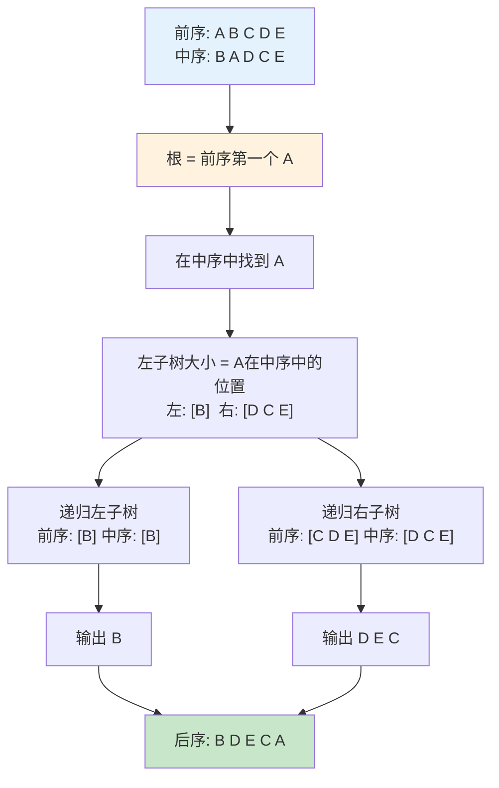

# 遍历二叉树题解：从前序+中序重建后序

> 两题一脉：给出二叉树的前序遍历和中序遍历，求后序遍历。
> P3909 输入为字符串，n ≤ 26；P3911 输入为整数数组，n ≤ 10⁶。
>
> **练习说明**：下方代码中挖去了若干关键处（`______`）。
> 答案均已藏在前面文字描述之中，仔细读一遍就能找到。自己填完再对。

---

## 为什么前序+中序能唯一确定二叉树？

先看三序遍历的根访问时机：

| 遍历方式 | 访问顺序 | 根的位置 |
|---------|---------|---------|
| 前序 | 根 → 左 → 右 | **第一个** |
| 中序 | 左 → 根 → 右 | **中间**（左树全在根左，右树全在根右） |
| 后序 | 左 → 右 → 根 | **最后一个** |

**关键观察：**

前序的第一个节点一定是整棵树的**根**。找到这个根在中序中的位置——左边全是左子树的节点，右边全是右子树的节点。

```
前序: [根] [左子树的前序] [右子树的前序]
中序: [左子树的中序] [根] [右子树的中序]
          ←左子树→    ←右子树→
```

左子树大小 = `根在中序中的位置 - 中序左边界`。

递归重复这个过程，就能重建整棵树（或直接输出后序）。



---

## P3909 · 遍历二叉树2

### 题面速览

- **输入**：两行字符串（大写字母），长度 ≤ 26，分别为前序和中序
- **输出**：一行字符串，后序遍历序列
- **范围**：n ≤ 26，极小

### 直觉入口——递归就是第一反应

一看到「前序+中序→后序」，第一反应就是一个递归函数：

```
function dfs(l, r):              // l, r 是中序范围
    if l > r: return             // 空子树，递归出口
    rt = a[k++]                  // 取前序当前位置为根，光标后移
    p = 在中序[l..r] 中找 rt      // 确定左右分界
    dfs(l, p - 1)                // 左子树
    dfs(p + 1, r)                // 右子树
    output rt                    // 后序最后输出根
```

n ≤ 26，中序每次线性搜索也无所谓——最坏 26×26 = 676 次操作，不可能超时。

### 转折——写就完了，没什么弯

本题没有隐藏歧路。n 太小，什么做法都能过。
唯一需要注意：字符串和子串边界的处理。一个常见的边界错误：

```
左子树大小 = p - l
递归左: dfs(l, p - 1)     ✓
递归右: dfs(p + 1, r)     ✓
```

### 代码实现（C++）——填一填

仔细看上文的伪代码，`a[k++]` 取前序当前位置为根，`while(b[p] != rt)` 在中序中找根，
`dfs(l, p - 1)` 递归左子树，`dfs(p + 1, r)` 递归右子树，`cout << rt` 输出根。
空子树判 `l > r`。把下面 `______` 补全：

```cpp
#include <iostream>
using namespace std;

string a, b;   // a: 前序, b: 中序
int k = 0;         // 当前前序下标

void dfs(int l, int r)
{
    if (______) return;           // 空子树则返回
    char rt = _______;            // 取前序当前位置为根，光标后移
    int p = l;
    while (b[p] != ____) p++;     // 在中序中找根
    dfs(l, p - 1);                // 递归左子树
    dfs(p + 1, r);                // 递归右子树
    cout << rt;                   // 后序输出根
}

int main()
{
    cin >> a >> b;
    dfs(0, a.size() - 1);
    return 0;
}
```

### 复杂度

| 维度 | 值 |
|------|-----|
| 时间 | O(n²) —— 每层递归线性查找根，最坏链状树 → n + (n-1) + ... + 1 = O(n²)。但 n ≤ 26 无所谓。 |
| 空间 | O(n) —— 递归深度最多 n 层（链树），每层常数开销 |

### 样例验证

```
前序: A B G K L M C H J F
中序: B L K M G A H C J F

第一层：
  root = 'A', 在中序位置 pos = 5
  leftSize = 5 - 0 = 5 → 左子树有 5 个节点
  左子树前序: B G K L M  中序: B L K M G
  右子树前序: C H J F    中序: H C J F

第二层（左子树）：
  root = 'B', 在中序位置 pos = 0
  leftSize = 0 → 左子树空
  右子树前序: G K L M  中序: L K M G

  第三层：
    root = 'G', 中序 pos = 3
    leftSize = 3 → 左子树 3 个节点
    左子树前序: K L M  中序: L K M
    右子树空

    ...

最终后序: L M K G B H F J C A
          √ 与样例一致
```

---

## P3911 · 遍历二叉树3

### 题面速览

- **输入**：
  - 第一行 n
  - 第二行 n 个整数——前序遍历（1∼n 各一次）
  - 第三行 n 个整数——中序遍历（1∼n 各一次）
- **输出**：一行 n 个整数——后序遍历
- **范围**：n ≤ **10⁶**
- **时间**：1000~2000ms
- **内存**：256 MiB

### 朴素递归——和 P3909 完全一样

逻辑完全一致：前序第一个为根 → 中序找根分左右 → 递归左右 → 最后输出根。

区别只在输入从 `string` 换成整数数组，且 n 最大 10⁶，故用全局数组存。
注意数组下标从 1 开始，`k` 初值为 1。输出后序时末尾加空格。

```cpp
#include <iostream>
using namespace std;

const int N = 1000005;
int a[N], b[N];   // a: 前序, b: 中序
int k = ______;   // 当前前序下标（1 还是 0？）

void dfs(int l, int r)
{
    if (______) return;           // 空子树则返回
    int rt = _______;             // 取前序当前位置为根，光标后移
    int p = l;
    while (b[p] != ____) p++;     // 在中序中找根
    dfs(l, p - 1);                // 递归左子树
    dfs(p + 1, r);                // 递归右子树
    cout << rt << ' ';            // 后序输出根
}

int main()
{
    ios::sync_with_stdio(false);
    cin.tie(nullptr);

    int n; cin >> n;
    for (int i = 1; i <= n; i++) cin >> a[i];
    for (int i = 1; i <= n; i++) cin >> b[i];

    dfs(1, n);
    return 0;
}
```

### 复杂度

| 维度 | 值 |
|------|-----|
| 时间 | O(n²) —— 每层递归循环找根 |
| 空间 | O(n) —— 存前中后序 + 递归栈 |

### 样例验证

```
前序: 7 4 1 6 2 9 8 3 5 10
中序: 2 6 9 1 3 8 5 4 7 10

第一层：r=7, p=9（中序第9位）, l=8
  左子树 a[2..9] = 4 1 6 2 9 8 3 5
          b[1..8] = 2 6 9 1 3 8 5 4
第二层：r=4, p=8, l=7
  左子树 a[3..9] = 1 6 2 9 8 3 5
          b[1..7] = 2 6 9 1 3 8 5
第三层：r=1, p=4, l=3
  左子树 a[4..6] = 6 2 9
          b[1..3] = 2 6 9
……

最终 ans = {2,9,6,3,5,8,1,4,10,7}  ← 与样例一致 ✓
```

---

## 两题串联总结

| | P3909 遍历二叉树2 | P3911 遍历二叉树3 |
|---|---|---|
| 数据规模 | n ≤ 26 | n ≤ 10⁶ |
| 核心算法 | 递归重建 | 递归重建 |
| 找根位置 | 循环扫 | 循环扫 |
| 本质 | 前序定根，中序分左右，递归输出后序 | 完全相同 |

两道题本质是同一算法——前序定根，中序分左右，递归输出后序。
